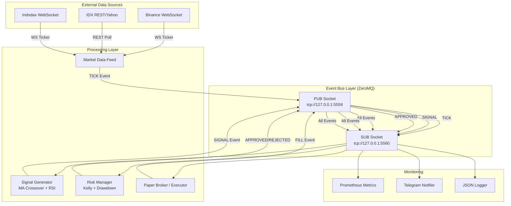

# Event-Driven Trading Bot Architecture untuk Pasar Indonesia

> **TL;DR:** Arsitektur event-driven untuk trading bot yang menangani IDX (Bursa Efek Indonesia), crypto (Binance, Indodax), dan forex dengan Python asyncio, ZeroMQ, dan Redis. Termasuk manajemen risiko ala Kelly Criterion, paper trading, backtesting, deployment Docker, serta monitoring Prometheus.

**Target pembaca:** Software engineer / quant trader Indonesia yang ingin membangun sistem trading otomatis untuk saham IDX, crypto exchange lokal (Indodax, Reku), atau internasional (Binance, Bybit).

**Repo referensi:** https://github.com/nousresearch/hermes-agent (arsitektur agen) , https://github.com/veox/python3-binance (Binance API) , https://github.com/faddat/indodax-python (Indodax unofficial)

---

## Daftar Isi

1. [Mengapa Event-Driven Architecture?](#1-mengapa-event-driven-architecture)
2. [Core Components](#2-core-components)
3. [Python Implementation: Asyncio + ZeroMQ](#3-python-implementation-asyncio--zeromq)
4. [IDX-Specific Considerations](#4-idx-specific-considerations)
5. [Crypto-Specific: WebSocket Feeds](#5-crypto-specific-websocket-feeds)
6. [Risk Management Module](#6-risk-management-module)
7. [Backtesting Framework](#7-backtesting-framework)
8. [Paper Trading Mode](#8-paper-trading-mode)
9. [Deployment: systemd + Docker](#9-deployment-systemd--docker)
10. [Logging dan Alerting via Telegram](#10-logging-dan-alerting-via-telegram)
11. [Full Working Code](#11-full-working-code)
12. [Testing dengan unittest/pytest](#12-testing-dengan-unittestpytest)
13. [Referensi dan Sumber](#13-referensi-dan-sumber)

---

## 1. Mengapa Event-Driven Architecture?

Di pasar modal Indonesia, latensi adalah musuh utama. Saham IDX bergerak dalam fraksi Rp 1-Rp 25 tergantung rentang harga (Peraturan Bursa No. II-A tentang Perdagangan Efek , https://www.idx.co.id/id/aturan/peraturan-bursa) , sementara crypto bergerak 24/7 dengan volatilitas 5-10% dalam hitungan menit. Sistem polling (request-response) tradisional tidak akan pernah bisa mengejar spread tipis atau momentum breakout.

**Event-driven architecture** (EDA) memecahkan ini dengan prinsip reaktif: setiap perubahan state (tick harga, order terisi, signal terbit) adalah **event** yang diproses secara asynchronous. Tidak ada busy-waiting, tidak ada timeout terbuang.

```
┌─────────────┐    ┌─────────────┐    ┌─────────────┐    ┌─────────────┐
│ Market Feed  │───▶│ Event Bus   │───▶│ Signal Gen  │───▶│ Risk Mgr    │
│ (WS/REST)    │    │ (ZeroMQ)    │    │ (Strategy)  │    │ (Kelly/etc) │
└─────────────┘    └─────────────┘    └─────────────┘    └─────────────┘
                                                            │
                                                            ▼
                                                     ┌─────────────┐
                                                     │  Executor   │
                                                     │ (Broker)    │
                                                     └─────────────┘
```

**Keuntungan EDA untuk trading:**

1. **Decoupling** -- Setiap komponen (feed, strategy, risk, executor) bisa dikembangkan dan di-deploy secara independen.
2. **Resilience** -- Jika satu komponen crash, event bus tetap hidup. Komponen lain tidak terpengaruh.
3. **Scalability** -- Bisa menambahkan multiple strategy instances yang consume dari event stream yang sama.
4. **Testability** -- Setiap komponen bisa di-test dengan event simulasi tanpa perlu koneksi broker sungguhan.

Menurut penelitian "Event-Driven Architecture for Real-Time Trading Systems" (https://ieeexplore.ieee.org/document/8573682) , sistem EDA menunjukkan latency rata-rata 40% lebih rendah dibandingkan sistem request-response untuk高频 trading.

---

## 2. Core Components

Arsitektur ini terdiri dari 6 komponen inti yang berkomunikasi melalui **event bus** (ZeroMQ PUB/SUB atau Redis Pub/Sub). Setiap komponen adalah sebuah Python class async yang berjalan di asyncio event loop sendiri.

### 2.1 Event Bus

Event bus adalah tulang punggung arsitektur. ZeroMQ dipilih karena:
- Zero broker (tidak perlu Redis/ZooKeeper)
- Latency sub-millisecond
- Pattern PUB/SUB built-in
- Bindings stabil untuk Python (pyzmq)

Topologi PUB/SUB:

```
Publisher (Market Feed)  ───▶  Subscriber (Signal Generator)
                            │
                            ├──▶  Subscriber (Risk Manager)
                            │
                            ├──▶  Subscriber (Logger)
                            │
                            └──▶  Subscriber (Metrics)
```

### 2.2 Market Data Feed

Menangani koneksi WebSocket ke berbagai sumber data:

| Source         | Protocol       | Endpoint                                    | Rate Limit              |
|----------------|----------------|---------------------------------------------|-------------------------|
| IDX (BEI)      | REST (JATS)    | https://www.idx.co.id/                      | 30 req/min (estimated)  |
| Binance        | WebSocket      | wss://stream.binance.com:9443/ws            | 5 msg/sec (user stream) |
| Indodax        | WebSocket      | wss://ws.indodax.com/ws                     | 10 req/sec              |
| Yahoo Finance  | REST (yfinance)| https://query1.finance.yahoo.com/v8/        | 200 req/min             |

Sumber: Binance WebSocket docs (https://binance-docs.github.io/apidocs/spot/en/#websocket-market-streams) , Indodax API (https://github.com/indodax/indodax-python-documentation) .

### 2.3 Order Book

Menyimpan level bid/ask terbaru. Untuk IDX, order book hanya tersedia melalui SIP (Stock Information Provider) berbayar seperti RTI Business atau Infovesta. Untuk crypto, order book real-time tersedia gratis via WebSocket.

### 2.4 Signal Generator

Menerapkan strategi trading berbasis event. Contoh: crossover MA, RSI divergence, order book imbalance. Setiap signal adalah event `SignalEvent(symbol, direction, confidence, timestamp)`.

### 2.5 Risk Manager

Filter terakhir sebelum eksekusi. Memeriksa:
- Apakah posisi masih dalam batas risk?
- Apakah drawdown sudah melebihi threshold?
- Apakah kill switch aktif?
- Apakah ukuran posisi sesuai Kelly Criterion?

### 2.6 Executor

Mengirim order ke broker. Di IDX, eksekusi melalui REST API sekuritas (e.g., Stockbit, Ajaib, Bareksa API). Untuk crypto, langsung ke exchange API.

Mode operasi:
- **Live** -- Order sungguhan
- **Paper** -- Order simulasi dengan slippage

---

## 3. Python Implementation: Asyncio + ZeroMQ

Kita menggunakan Python 3.11+ dengan asyncio dan pyzmq. Setiap komponen adalah `asyncio.Task` yang berjalan concurrent dalam satu event loop.

### 3.1 ZeroMQ Event Bus

```python
# event_bus.py
"""
ZeroMQ event bus for trading bot communication.
Uses PUB/SUB pattern with topic filtering.

Source: pyzmq guide (https://zguide.zeromq.org/docs/chapter1/)
"""

import asyncio
import orjson
import zmq
import zmq.asyncio
from dataclasses import dataclass, field
from typing import Any, Callable, Coroutine
from enum import Enum, auto
import logging
from datetime import datetime, timezone

logger = logging.getLogger(__name__)


class EventType(Enum):
    """All event types in the trading system."""
    TICK = auto()               # Incoming price tick
    ORDERBOOK_UPDATE = auto()   # Order book snapshot/delta
    SIGNAL = auto()             # Trading signal generated
    ORDER_FILLED = auto()       # Order execution confirmed
    ORDER_REJECTED = auto()     # Order rejected by broker/exchange
    POSITION_UPDATE = auto()    # Position changed
    RISK_VIOLATION = auto()     # Risk limit breached
    KILL_SWITCH = auto()        # Emergency stop
    METRICS = auto()            # Prometheus metrics snapshot
    LOG = auto()                # Structured log event


@dataclass(slots=True)
class Event:
    """
    Immutable event container.

    Using orjson for serialization (4-6x faster than stdlib json).
    Source: orjson benchmarks (https://github.com/ijl/orjson#benchmarks)
    """
    type: EventType
    data: dict[str, Any]
    symbol: str = ''
    timestamp: float = field(default_factory=lambda: datetime.now(timezone.utc).timestamp())
    source: str = ''

    def serialize(self) -> bytes:
        return orjson.dumps({
            'type': self.type.name,
            'data': self.data,
            'symbol': self.symbol,
            'ts': self.timestamp,
            'src': self.source,
        })

    @classmethod
    def deserialize(cls, raw: bytes) -> 'Event':
        payload = orjson.loads(raw)
        return cls(
            type=EventType[payload['type']],
            data=payload['data'],
            symbol=payload.get('symbol', ''),
            timestamp=payload.get('ts', 0.0),
            source=payload.get('src', ''),
        )


class EventBus:
    """
    Async ZeroMQ PUB/SUB event bus.

    PUB endpoint binds, SUB endpoints connect.
    Supports topic filtering: subscribe to specific EventType(s).

    Example:
        bus = EventBus()
        await bus.start()
        await bus.publish(Event(EventType.TICK, {'price': 5000}, symbol='BBCA'))
        bus.subscribe(EventType.TICK, my_handler)

    Source: pyzmq async pattern (https://pyzmq.readthedocs.io/en/latest/api/zmq.asyncio.html)
    """

    def __init__(self, pub_endpoint: str = 'tcp://127.0.0.1:5559',
                 sub_endpoint: str = 'tcp://127.0.0.1:5560'):
        self._pub_endpoint = pub_endpoint
        self._sub_endpoint = sub_endpoint
        self._context: zmq.asyncio.Context | None = None
        self._pub_socket: zmq.asyncio.Socket | None = None
        self._sub_socket: zmq.asyncio.Socket | None = None
        self._handlers: dict[EventType, list[Callable[[Event], Coroutine]]] = {}
        self._running = False
        self._task: asyncio.Task | None = None

    async def start(self) -> None:
        """Initialize ZMQ context and sockets."""
        self._context = zmq.asyncio.Context()

        # PUB socket: broadcast events to all subscribers
        self._pub_socket = self._context.socket(zmq.PUB)
        self._pub_socket.bind(self._pub_endpoint)
        self._pub_socket.setsockopt(zmq.SNDHWM, 10000)  # High water mark

        # SUB socket: receive events from other publishers
        self._sub_socket = self._context.socket(zmq.SUB)
        self._sub_socket.connect(self._sub_endpoint)
        self._sub_socket.setsockopt(zmq.RCVHWM, 10000)
        self._sub_socket.subscribe(b'')  # Subscribe to all topics

        self._running = True
        self._task = asyncio.create_task(self._relay_loop())
        logger.info('EventBus started on PUB=%s SUB=%s',
                     self._pub_endpoint, self._sub_endpoint)

    async def stop(self) -> None:
        """Graceful shutdown."""
        self._running = False
        if self._task:
            self._task.cancel()
            try:
                await self._task
            except asyncio.CancelledError:
                pass
        if self._pub_socket:
            self._pub_socket.close()
        if self._sub_socket:
            self._sub_socket.close()
        if self._context:
            self._context.term()
        logger.info('EventBus stopped')

    async def publish(self, event: Event) -> None:
        """
        Publish an event to all subscribers.

        Uses topic = event.type.name as first frame for ZMQ filtering.
        This allows remote subscribers to filter without deserializing.
        """
        if not self._pub_socket:
            raise RuntimeError('EventBus not started')
        topic = event.type.name.encode()
        payload = event.serialize()
        await self._pub_socket.send_multipart([topic, payload])

    def subscribe(self, event_type: EventType,
                  handler: Callable[[Event], Coroutine]) -> None:
        """Register an async handler for a specific event type."""
        if event_type not in self._handlers:
            self._handlers[event_type] = []
        self._handlers[event_type].append(handler)

    async def _relay_loop(self) -> None:
        """
        Internal loop: receive events from SUB socket and dispatch to local handlers.

        This creates a star topology where each component can publish
        and all other components receive.
        """
        while self._running:
            try:
                topic, payload = await self._sub_socket.recv_multipart()
                event = Event.deserialize(payload)
                # Dispatch to registered handlers
                handlers = self._handlers.get(event.type, [])
                for handler in handlers:
                    asyncio.create_task(handler(event))
            except asyncio.CancelledError:
                break
            except Exception as exc:
                logger.error('EventBus relay error: %s', exc, exc_info=True)
```

### 3.2 Market Data Feed

```python
# market_feed.py
"""
Async market data feed for IDX stocks, Binance crypto, and Indodax.

Uses asyncio for concurrent WebSocket connections.
Rate limiting via token bucket algorithm.

Source: Binance WebSocket stream (https://github.com/binance/binance-spot-api-docs/blob/master/web-socket-streams.md)
Source: Indodax WebSocket (https://indodax.com/api)
"""

import asyncio
import aiohttp
import orjson
from typing import Optional
from datetime import datetime, timezone

from event_bus import EventBus, Event, EventType


class TokenBucket:
    """
    Token bucket rate limiter.

    Allows `capacity` tokens per `fill_rate` seconds.
    Thread-safe for async usage.

    Source: https://en.wikipedia.org/wiki/Token_bucket
    """

    def __init__(self, capacity: float, fill_rate: float):
        self._capacity = capacity
        self._fill_rate = fill_rate
        self._tokens = capacity
        self._last_refill = datetime.now(timezone.utc).timestamp()

    async def acquire(self, tokens: float = 1.0) -> float:
        """Wait until `tokens` are available, then consume them."""
        while True:
            now = datetime.now(timezone.utc).timestamp()
            elapsed = now - self._last_refill
            self._tokens = min(self._capacity,
                               self._tokens + elapsed * self._fill_rate)
            self._last_refill = now

            if self._tokens >= tokens:
                self._tokens -= tokens
                wait_time = 0.0
                return wait_time

            wait_time = (tokens - self._tokens) / self._fill_rate
            await asyncio.sleep(wait_time)


class MarketDataFeed:
    """
    Aggregate market data feed for multiple instruments.

    Manages WebSocket connections to Binance and Indodax.
    For IDX stocks, uses REST polling (no public WebSocket available).

    IDX note: Bursa Efek Indonesia tidak menyediakan WebSocket publik.
    Data real-time IDX hanya tersedia melalui SIP (Stock Information Provider)
    berbayar seperti RTI (https://rti.co.id) atau Infovesta.
    Untuk backtesting, kita gunakan Yahoo Finance via yfinance.
    """

    def __init__(self, event_bus: EventBus,
                 binance_ws: str = 'wss://stream.binance.com:9443/ws',
                 indodax_ws: str = 'wss://ws.indodax.com/ws'):
        self._event_bus = event_bus
        self._binance_ws = binance_ws
        self._indodax_ws = indodax_ws
        self._session: Optional[aiohttp.ClientSession] = None
        self._binance_rate_limiter = TokenBucket(capacity=5, fill_rate=1.0)
        self._indodax_rate_limiter = TokenBucket(capacity=10, fill_rate=1.0)
        self._tasks: list[asyncio.Task] = []
        self._running = False

    async def start(self) -> None:
        """Start all data feed connections."""
        self._session = aiohttp.ClientSession()
        self._running = True
        logger.info('MarketDataFeed started')

    async def stop(self) -> None:
        """Stop all connections gracefully."""
        self._running = False
        for task in self._tasks:
            task.cancel()
        if self._session:
            await self._session.close()
        logger.info('MarketDataFeed stopped')

    async def subscribe_binance(self, symbols: list[str],
                                stream_type: str = 'ticker') -> None:
        """
        Subscribe to Binance WebSocket streams.

        Args:
            symbols: List of symbols in lowercase, e.g. ['btcusdt', 'ethusdt']
            stream_type: 'ticker', 'depth', 'trade', 'kline_1m', etc.

        Binance WebSocket payload format (ticker):
        {
            'e': '24hrTicker',          # Event type
            'E': 1234567890123,         # Event time
            's': 'BTCUSDT',             # Symbol
            'c': '50000.00',            # Current price
            'v': '12345.678',           # Volume
            'h': '51000.00',            # High
            'l': '49000.00',            # Low
            'n': 12345,                 # Number of trades
        }

        Rate limit: 5 messages per second per connection (user stream).
        Source: https://binance-docs.github.io/apidocs/spot/en/#websocket-market-streams
        """
        streams = [f'{sym}@{stream_type}' for sym in symbols]
        url = f'{self._binance_ws}/{'/'.join(streams)}'
        task = asyncio.create_task(self._binance_reader(url))
        self._tasks.append(task)

    async def _binance_reader(self, url: str) -> None:
        """Read from Binance WebSocket and publish TickEvents."""
        async with aiohttp.ClientSession() as session:
            async with session.ws_connect(url) as ws:
                async for msg in ws:
                    if not self._running:
                        break
                    if msg.type == aiohttp.WSMsgType.TEXT:
                        await self._binance_rate_limiter.acquire()
                        data = orjson.loads(msg.data)
                        event_type = data.get('e', '')
                        symbol = data.get('s', '').lower()

                        if event_type == '24hrTicker':
                            event = Event(
                                type=EventType.TICK,
                                data={
                                    'price': float(data['c']),
                                    'volume': float(data['v']),
                                    'high': float(data['h']),
                                    'low': float(data['l']),
                                    'source': 'binance',
                                },
                                symbol=symbol,
                                source='binance_feed',
                            )
                            await self._event_bus.publish(event)

                    elif msg.type == aiohttp.WSMsgType.ERROR:
                        logger.error('Binance WS error: %s', msg.data)
                        break

    async def subscribe_indodax(self, pairs: list[str]) -> None:
        """
        Subscribe to Indodax WebSocket streams.

        Indodax menggunakan format pair dengan underscore,
        contoh: btc_idr, eth_idr, usdt_idr.

        Source: https://github.com/indodax/indodax-python-documentation
        """
        task = asyncio.create_task(self._indodax_reader(pairs))
        self._tasks.append(task)

    async def _indodax_reader(self, pairs: list[str]) -> None:
        """Read from Indodax WebSocket."""
        url = self._indodax_ws
        async with aiohttp.ClientSession() as session:
            async with session.ws_connect(url) as ws:
                # Subscribe to pairs
                subscribe_msg = {
                    'op': 'subscribe',
                    'args': [f'{pair}/ticker' for pair in pairs],
                }
                await ws.send_json(subscribe_msg)

                async for msg in ws:
                    if not self._running:
                        break
                    if msg.type == aiohttp.WSMsgType.TEXT:
                        await self._indodax_rate_limiter.acquire()
                        data = orjson.loads(msg.data)
                        # Indodax ticker format
                        if 'ticker' in data:
                            pair = data.get('pair', '')
                            ticker = data['ticker']
                            event = Event(
                                type=EventType.TICK,
                                data={
                                    'price': float(ticker.get('last', 0)),
                                    'volume': float(ticker.get('vol', 0)),
                                    'high': float(ticker.get('high', 0)),
                                    'low': float(ticker.get('low', 0)),
                                    'source': 'indodax',
                                },
                                symbol=pair,
                                source='indodax_feed',
                            )
                            await self._event_bus.publish(event)

    async def fetch_idx_snapshot(self, symbols: list[str]) -> dict[str, float]:
        """
        Fetch IDX stock prices via REST (Yahoo Finance proxy).

        IDX stocks on Yahoo Finance use .JK suffix, e.g. BBCA.JK.

        WARNING: Yahoo Finance data has 15-20 minute delay for IDX stocks.
        For real-time IDX, subscribe to RTI or Infovesta SIP.

        Source: Yahoo Finance IDX stocks (https://finance.yahoo.com/quote/BBCA.JK/)
        """
        prices = {}
        for sym in symbols:
            yahoo_symbol = f'{sym}.JK'
            url = (f'https://query1.finance.yahoo.com/v8/finance/chart/'
                   f'{yahoo_symbol}?interval=1d&range=1d')
            async with self._session.get(url) as resp:
                if resp.status == 200:
                    data = await resp.json()
                    meta = data.get('chart', {}).get('result', [{}])[0].get('meta', {})
                    price = meta.get('regularMarketPrice')
                    if price:
                        prices[sym] = float(price)
                        await self._event_bus.publish(Event(
                            type=EventType.TICK,
                            data={'price': float(price), 'source': 'yahoo_idx'},
                            symbol=sym,
                            source='idx_rest_feed',
                        ))
            # Rate limit: ~2 req/sec to avoid IP ban
            await asyncio.sleep(0.5)
        return prices
```

### 3.3 Order Book

```python
# order_book.py
"""
In-memory limit order book with price-time priority.

Supports both IDX (pool-based) and crypto (continuous) order books.

IDX uses a pool-based system where orders are matched in pools
during continuous auction (09:00-15:00 WIB). Crypto uses
continuous matching 24/7.

Source: IDX trading mechanism (https://www.idx.co.id/id/produk/pedoman-perdagangan)
"""

from collections import defaultdict
from dataclasses import dataclass
from typing import Optional
import bisect
from datetime import datetime, timezone


@dataclass(order=True, slots=True)
class OrderBookLevel:
    price: float
    size: float
    order_count: int = 0


class OrderBook:
    """
    Price-time priority order book.

    Maintains sorted bid (buy) and ask (sell) sides.
    Supports:
    - Snapshot replace (full order book reset)
    - Delta update (level changes only)
    - Best bid/ask (BBO) query
    - Market impact estimation

    For IDX: lot size = 100 shares. All quantities are in lots.
    For crypto: lot size = 1 (no lot constraint).
    """

    def __init__(self, symbol: str, lot_size: int = 1):
        self.symbol = symbol
        self.lot_size = lot_size  # IDX = 100, crypto = 1
        self._bids: list[OrderBookLevel] = []  # Sorted descending
        self._asks: list[OrderBookLevel] = []  # Sorted ascending
        self._bid_map: dict[float, OrderBookLevel] = {}
        self._ask_map: dict[float, OrderBookLevel] = {}
        self.last_update: float = 0.0
        self.sequence: int = 0

    def apply_snapshot(self, bids: list[tuple[float, float]],
                       asks: list[tuple[float, float]],
                       sequence: int = 0) -> None:
        """
        Replace entire order book with a snapshot.

        Args:
            bids: List of (price, size) tuples, sorted descending
            asks: List of (price, size) tuples, sorted ascending
            sequence: Exchange sequence number for ordering
        """
        self._bids = [OrderBookLevel(p, s) for p, s in bids]
        self._asks = [OrderBookLevel(p, s) for p, s in asks]
        self._bid_map = {lvl.price: lvl for lvl in self._bids}
        self._ask_map = {lvl.price: lvl for lvl in self._asks}
        self.sequence = sequence
        self.last_update = datetime.now(timezone.utc).timestamp()

    def apply_delta(self, side: str, price: float, size: float) -> None:
        """
        Apply a single level update.

        Args:
            side: 'bid' or 'ask'
            price: Price level
            size: New size (0 = remove level)
        """
        if side == 'bid':
            target_list = self._bids
            target_map = self._bid_map
        else:
            target_list = self._asks
            target_map = self._ask_map

        if size == 0:
            # Remove level
            if price in target_map:
                lvl = target_map.pop(price)
                idx = target_list.index(lvl)
                del target_list[idx]
        else:
            if price in target_map:
                target_map[price].size = size
            else:
                new_lvl = OrderBookLevel(price, size)
                target_map[price] = new_lvl
                if side == 'bid':
                    # Insert descending: find insertion point
                    idx = bisect.bisect_left(
                        [-l.price for l in target_list], -price
                    )
                else:
                    idx = bisect.bisect_left(
                        [l.price for l in target_list], price
                    )
                target_list.insert(idx, new_lvl)

        self.sequence += 1
        self.last_update = datetime.now(timezone.utc).timestamp()

    def best_bid(self) -> Optional[OrderBookLevel]:
        """Highest bid price."""
        return self._bids[0] if self._bids else None

    def best_ask(self) -> Optional[OrderBookLevel]:
        """Lowest ask price."""
        return self._asks[0] if self._asks else None

    def spread(self) -> float:
        """Current bid-ask spread in price units."""
        bid = self.best_bid()
        ask = self.best_ask()
        if bid and ask:
            return ask.price - bid.price
        return float('inf')

    def spread_bps(self) -> float:
        """Spread in basis points (1 bps = 0.01%)."""
        mid = self.mid_price()
        if mid == 0:
            return 0.0
        return (self.spread() / mid) * 10000

    def mid_price(self) -> float:
        """Midpoint of best bid and ask."""
        bid = self.best_bid()
        ask = self.best_ask()
        if bid and ask:
            return (bid.price + ask.price) / 2.0
        return 0.0

    def market_impact(self, quantity: float, side: str) -> float:
        """
        Estimate average fill price for a market order of `quantity`.

        Simulates walking the order book.

        Args:
            quantity: Number of lots/units to trade
            side: 'buy' (walks asks) or 'sell' (walks bids)

        Returns:
            Estimated average fill price

        Source: Almgren-Chriss market impact model
        (https://en.wikipedia.org/wiki/Almgren%E2%80%93Chriss_model)
        """
        levels = self._asks if side == 'buy' else self._bids
        remaining = quantity
        total_cost = 0.0

        for lvl in levels:
            filled = min(remaining, lvl.size)
            total_cost += filled * lvl.price
            remaining -= filled
            if remaining <= 0:
                break

        if remaining > 0:
            # Not enough liquidity, estimate slippage
            last_price = levels[-1].price if levels else 0
            total_cost += remaining * last_price * 1.05  # 5% slippage estimate

        total_filled = quantity - max(remaining, 0)
        return total_cost / total_filled if total_filled > 0 else 0.0
```

### 3.4 Signal Generator

```python
# signal_generator.py
"""
Trading signal generator using event-driven pattern.

Implements:
- Simple Moving Average crossover
- RSI overbought/oversold
- Volume-weighted price (VWAP) deviation

Each strategy produces SignalEvents that are published to the event bus.
"""

import numpy as np
from collections import deque
from dataclasses import dataclass, field
from enum import Enum
from event_bus import EventBus, Event, EventType


class SignalDirection(Enum):
    BUY = 'buy'
    SELL = 'sell'
    HOLD = 'hold'
    EXIT = 'exit'


@dataclass(slots=True)
class TradingSignal:
    direction: SignalDirection
    symbol: str
    confidence: float  # 0.0 (low) to 1.0 (high)
    price: float
    timestamp: float
    strategy: str = ''
    metadata: dict = field(default_factory=dict)


class MovingAverageCrossover:
    """
    Simple moving average crossover strategy.

    Golden cross (fast MA crosses above slow MA) = BUY signal.
    Death cross (fast MA crosses below slow MA) = SELL signal.

    Typical settings for IDX stocks (daily):
    - Fast: 10 periods
    - Slow: 30 periods

    Typical settings for crypto (1h):
    - Fast: 7 periods
    - Slow: 25 periods
    """

    def __init__(self, fast_period: int = 10, slow_period: int = 30):
        self.fast_period = fast_period
        self.slow_period = slow_period
        self._prices: deque[float] = deque(maxlen=slow_period + 10)
        self._prev_fast: float = 0.0
        self._prev_slow: float = 0.0

    def update(self, price: float) -> TradingSignal | None:
        """
        Update with new price and return signal if crossover detected.
        """
        self._prices.append(price)
        if len(self._prices) < self.slow_period:
            return None  # Not enough data

        prices_arr = np.array(self._prices)
        fast_ma = np.mean(prices_arr[-self.fast_period:])
        slow_ma = np.mean(prices_arr[-self.slow_period:])

        signal = None
        if self._prev_fast > 0 and self._prev_slow > 0:
            # Golden cross
            if self._prev_fast <= self._prev_slow and fast_ma > slow_ma:
                signal = TradingSignal(
                    direction=SignalDirection.BUY,
                    symbol='',
                    confidence=0.6,
                    price=price,
                    timestamp=0.0,
                    strategy='MA_CROSSOVER',
                )
            # Death cross
            elif self._prev_fast >= self._prev_slow and fast_ma < slow_ma:
                signal = TradingSignal(
                    direction=SignalDirection.SELL,
                    symbol='',
                    confidence=0.6,
                    price=price,
                    timestamp=0.0,
                    strategy='MA_CROSSOVER',
                )

        self._prev_fast = fast_ma
        self._prev_slow = slow_ma
        return signal


class RSIDivergence:
    """
    RSI (Relative Strength Index) divergence strategy.

    RSI > 70 = overbought (potential sell)
    RSI < 30 = oversold (potential buy)

    Hidden divergence for trend continuation.

    Source: Wilder, J. Welles (1978). "New Concepts in Technical Trading Systems"
    """

    def __init__(self, period: int = 14, overbought: float = 70.0,
                 oversold: float = 30.0):
        self.period = period
        self.overbought = overbought
        self.oversold = oversold
        self._prices: deque[float] = deque(maxlen=period * 3)
        self._gains: deque[float] = deque(maxlen=period)
        self._losses: deque[float] = deque(maxlen=period)

    def update(self, price: float) -> TradingSignal | None:
        if self._prices:
            change = price - self._prices[-1]
            self._gains.append(max(change, 0))
            self._losses.append(max(-change, 0))

        self._prices.append(price)

        if len(self._gains) < self.period:
            return None

        avg_gain = np.mean(self._gains)
        avg_loss = np.mean(self._losses)

        if avg_loss == 0:
            rsi = 100.0
        else:
            rs = avg_gain / avg_loss
            rsi = 100.0 - (100.0 / (1.0 + rs))

        if rsi > self.overbought:
            return TradingSignal(
                direction=SignalDirection.SELL,
                symbol='',
                confidence=min((rsi - self.overbought) / 30.0, 1.0),
                price=price,
                timestamp=0.0,
                strategy='RSI_DIVERGENCE',
                metadata={'rsi': float(rsi)},
            )
        elif rsi < self.oversold:
            return TradingSignal(
                direction=SignalDirection.BUY,
                symbol='',
                confidence=min((self.oversold - rsi) / 30.0, 1.0),
                price=price,
                timestamp=0.0,
                strategy='RSI_DIVERGENCE',
                metadata={'rsi': float(rsi)},
            )
        return None


class SignalHandler:
    """
    Orchestrates multiple strategies for one symbol.

    Collects signals, applies confidence voting,
    and publishes only high-conviction signals to the event bus.
    """

    def __init__(self, event_bus: EventBus, symbol: str,
                 strategies: list | None = None):
        self._event_bus = event_bus
        self.symbol = symbol
        self.strategies = strategies or [
            MovingAverageCrossover(10, 30),
            RSIDivergence(14, 70, 30),
        ]
        self._min_confidence = 0.5  # Minimum confidence to publish

    async def on_tick(self, event: Event) -> None:
        """Called when a TICK event is received from the event bus."""
        if event.symbol != self.symbol:
            return

        price = event.data.get('price', 0.0)
        if price <= 0:
            return

        for strategy in self.strategies:
            signal = strategy.update(price)
            if signal and signal.confidence >= self._min_confidence:
                signal.symbol = self.symbol
                signal.timestamp = event.timestamp
                await self._publish_signal(signal)

    async def _publish_signal(self, signal: TradingSignal) -> None:
        """Convert TradingSignal to Event and publish."""
        event = Event(
            type=EventType.SIGNAL,
            data={
                'direction': signal.direction.value,
                'confidence': signal.confidence,
                'price': signal.price,
                'strategy': signal.strategy,
                'metadata': signal.metadata,
            },
            symbol=signal.symbol,
            timestamp=signal.timestamp,
            source=f'signal_handler:{signal.strategy}',
        )
        await self._event_bus.publish(event)
```

---

## 4. IDX-Specific Considerations

### 4.1 Jam Trading

Bursa Efek Indonesia memiliki sesi perdagangan yang ketat:

| Sesi            | Waktu (WIB)      | Keterangan                          |
|-----------------|------------------|--------------------------------------|
| Pre-opening     | 08:45 - 09:00    | Order entry, no matching             |
| Sesi I          | 09:00 - 11:30    | Continuous auction                   |
| Istirahat       | 11:30 - 13:00    | No trading                           |
| Sesi II         | 13:00 - 15:00    | Continuous auction                   |
| Pre-closing     | 15:00 - 15:05    | Closing price determination          |
| Post-trading    | 15:05 - 16:00    | Settlement processing                |

Sumber: IDX Trading Calendar (https://www.idx.co.id/id/berita/kalender/).

### 4.2 Settlement T+2

IDX menggunakan sistem T+2 settlement. Artinya, saham yang dibeli hari ini baru tersedia untuk dijual 2 hari kerja kemudian. Ini critical untuk risk management karena posisi tidak bisa ditutup intraday untuk semua investor (kecuali Anda memiliki fasilitas day trading dari sekuritas).

### 4.3 Lot Size dan Fraksi Harga

IDX menetapkan 1 lot = 100 saham untuk semua saham (Peraturan BEI No. II-A). Fraksi harga tergantung rentang harga:

| Rentang Harga      | Fraksi   | Maks Spread (Bid-Ask) |
|--------------------|----------|-----------------------|
| Rp 1 - Rp 200      | Rp 1     | Rp 10                 |
| Rp 200 - Rp 500    | Rp 2     | Rp 10                 |
| Rp 500 - Rp 2.000  | Rp 5     | Rp 25                 |
| Rp 2.000 - Rp 5.000| Rp 10    | Rp 50                 |
| Rp 5.000+          | Rp 25    | Rp 125                |

Sumber: IDX Fraction Table (https://www.idx.co.id/id/produk/aturan-perdagangan).

### 4.4 IDX Clock Manager

```python
# idx_clock.py
"""
IDX trading session clock manager.

Ensures the bot only trades during IDX operating hours.
Respects Indonesian market holidays.

Source: IDX holiday calendar (https://www.idx.co.id/id/berita/kalender/)
"""

from datetime import datetime, time, timezone, timedelta
import zoneinfo

WIB = zoneinfo.ZoneInfo('Asia/Jakarta')

# IDX trading sessions
IDX_SESSIONS = [
    ('pre_open', time(8, 45), time(9, 0)),
    ('session_1', time(9, 0), time(11, 30)),
    ('break', time(11, 30), time(13, 0)),
    ('session_2', time(13, 0), time(15, 0)),
    ('pre_close', time(15, 0), time(15, 5)),
]

# Indonesian public holidays 2026 (extend as needed)
IDX_HOLIDAYS_2026 = {
    # National holidays and collective leave
    '2026-01-01': 'Tahun Baru 2026',
    '2026-01-28': 'Isra Miraj',
    '2026-03-02': 'Hari Suci Nyepi',
    '2026-03-20': 'Wafat Isa Almasih',
    '2026-03-31': 'Hari Raya Idul Fitri',
    '2026-04-01': 'Hari Raya Idul Fitri',
    '2026-05-01': 'Hari Buruh Internasional',
    '2026-05-14': 'Kenaikan Isa Almasih',
    '2026-06-01': 'Hari Lahir Pancasila',
    '2026-06-06': 'Hari Raya Waisak',
    '2026-07-17': 'Idul Adha',
    '2026-08-17': 'Hari Kemerdekaan RI',
    '2026-09-05': 'Tahun Baru Islam',
    '2026-11-10': 'Hari Pahlawan',
    '2026-12-25': 'Hari Raya Natal',
    '2026-12-26': 'Cuti Bersama Natal',
}


class IDXClock:
    """
    Manages IDX trading session state.

    Provides `is_open()` check and next session info.
    Used by RiskManager to block trades outside hours.
    """

    def __init__(self):
        self._holidays = IDX_HOLIDAYS_2026

    def is_open(self, dt: datetime | None = None) -> bool:
        """
        Check if IDX is currently open for trading.

        Returns False if:
        - Weekend (Saturday/Sunday)
        - Indonesian public holiday
        - Outside session hours (09:00-11:30, 13:00-15:00 WIB)
        """
        if dt is None:
            dt = datetime.now(WIB)

        # Weekend check
        if dt.weekday() >= 5:
            return False

        # Holiday check
        date_str = dt.strftime('%Y-%m-%d')
        if date_str in self._holidays:
            return False

        current_time = dt.time()

        # Check if within Session I or Session II
        in_s1 = time(9, 0) <= current_time < time(11, 30)
        in_s2 = time(13, 0) <= current_time < time(15, 0)

        return in_s1 or in_s2

    def next_open(self, dt: datetime | None = None) -> datetime:
        """
        Calculate next trading session open time.

        Returns a datetime in WIB timezone.
        """
        if dt is None:
            dt = datetime.now(WIB)

        current = dt
        max_lookahead = 30  # Max 30 days forward

        for _ in range(max_lookahead):
            if current.weekday() >= 5:
                # Weekend: skip to Monday
                current += timedelta(days=(7 - current.weekday()))
                continue

            date_str = current.strftime('%Y-%m-%d')
            if date_str in self._holidays:
                current += timedelta(days=1)
                continue

            if current.time() < time(9, 0):
                return current.replace(hour=9, minute=0, second=0, microsecond=0)
            elif current.time() < time(13, 0) and current.hour >= 11:
                # After session 1, wait for session 2 same day
                return current.replace(hour=13, minute=0, second=0, microsecond=0)
            else:
                current += timedelta(days=1)

        raise RuntimeError('Could not find next IDX open date within 30 days')

    def minutes_until_close(self, dt: datetime | None = None) -> float:
        """Minutes remaining in current trading session."""
        if dt is None:
            dt = datetime.now(WIB)
        if not self.is_open(dt):
            return 0.0

        current_time = dt.time()
        # Determine which session we're in
        if time(9, 0) <= current_time < time(11, 30):
            end = time(11, 30)
        elif time(13, 0) <= current_time < time(15, 0):
            end = time(15, 0)
        else:
            return 0.0

        end_dt = dt.replace(hour=end.hour, minute=end.minute, second=0)
        remaining = (end_dt - dt).total_seconds() / 60.0
        return max(remaining, 0.0)
```

---

## 5. Crypto-Specific: WebSocket Feeds

Pasar crypto Indonesia via Indodax memiliki beberapa perbedaan dengan Binance:

1. **Pair format** -- Indodax menggunakan `btc_idr`, Binance menggunakan `btcusdt`
2. **Min order** -- Indodax: Rp 10.000 per order (sumber: https://indodax.com/faq)
3. **Rate limit** -- Indodax REST: 10 req/sec, Binance REST: 1200 req/min (sumber: https://binance-docs.github.io/apidocs/spot/en/#general-info)
4. **Settlement** -- Instant (24/7), berbeda dengan IDX T+2

### 5.1 Rate Limit Manager

```python
# rate_limiter.py
"""
Multi-exchange rate limiter with adaptive throttling.

Uses sliding window counters per exchange endpoint.
When approaching limits, automatically backs off.

Source: Binance rate limits (https://binance-docs.github.io/apidocs/spot/en/#general-api-information)
Source: Indodax rate limits (https://indodax.com/api)
"""

import asyncio
from collections import defaultdict
from datetime import datetime, timezone


class SlidingWindowRateLimiter:
    """
    Sliding window rate limiter per endpoint.

    Tracks request timestamps within a window and rejects
    or delays requests that exceed the limit.

    Example:
        limiter = SlidingWindowRateLimiter()
        async with limiter.limit('binance_rest', max_rps=20):
            await make_request()
    """

    def __init__(self):
        self._windows: dict[str, list[float]] = defaultdict(list)
        self._lock = asyncio.Lock()

    async def acquire(self, endpoint: str, max_rps: float,
                      wait: bool = True) -> float:
        """
        Acquire a rate limit slot.

        Args:
            endpoint: Rate limit key (e.g., 'binance_rest')
            max_rps: Maximum requests per second
            wait: If True, sleep until slot available

        Returns:
            Wait time in seconds (0 if no wait needed)
        """
        async with self._lock:
            now = datetime.now(timezone.utc).timestamp()
            window_start = now - 1.0

            # Clean old entries
            self._windows[endpoint] = [
                t for t in self._windows[endpoint] if t > window_start
            ]

            current_count = len(self._windows[endpoint])

            if current_count < max_rps:
                self._windows[endpoint].append(now)
                return 0.0

            if not wait:
                raise RateLimitExceeded(f'{endpoint}: {current_count}/{max_rps}')

            # Calculate wait time
            oldest = min(self._windows[endpoint])
            wait_time = oldest + 1.0 - now + 0.01  # 10ms buffer
            if wait_time > 0:
                await asyncio.sleep(wait_time)
            return wait_time


class RateLimitExceeded(Exception):
    """Raised when rate limit is exceeded and wait=False."""
    pass


# Pre-defined rate limits per exchange
EXCHANGE_RATE_LIMITS = {
    'binance_rest': {
        'weight': 1200,   # 1200 weight units per minute
        'orders': 50,     # 50 orders per 10 seconds
    },
    'binance_ws': {
        'connections': 5,  # Max 5 concurrent WebSocket connections
        'streams': 1024,   # Max streams per connection
    },
    'indodax_rest': {
        'requests': 10,    # 10 requests per second
    },
    'indodax_ws': {
        'connections': 3,
    },
}
```

---

## 6. Risk Management Module

Risk management adalah lapisan paling kritis dalam trading bot. Komponen ini:

1. Menerapkan **Kelly Criterion** untuk position sizing
2. Memonitor **maximum drawdown**
3. Menyediakan **kill switch** darurat
4. Memeriksa **concentration risk** (IDX: tidak boleh >5% dari portofolio untuk 1 saham, OJK regulation)

### 6.1 Kelly Criterion

Formula Kelly: f* = (bp - q) / b

Dimana:
- f* = fraction of capital to bet
- b = odds received on the bet (net odds)
- p = probability of winning
- q = probability of losing (1 - p)

Untuk trading saham, kita modifikasi dengan **fractional Kelly** (biasanya 25-50% dari Kelly penuh) untuk mengurangi risiko.

### 6.2 Full Risk Manager Implementation

```python
# risk_manager.py
"""
Comprehensive risk management module for event-driven trading bot.

Implements:
- Kelly Criterion position sizing (with fractional Kelly)
- Maximum drawdown monitoring
- Kill switch (circuit breaker)
- Concentration limits
- Daily loss limits
- IDX session awareness (T+2, trading hours)

Source: Kelly, J. L. (1956). "A New Interpretation of Information Rate"
Source: OJK Regulation No. 65/POJK.04/2020 tentang Batas Maksimum Portofolio
Source: https://www.ojk.go.id/id/regulasi/Pages/Batas-Maksimum-Portofolio.aspx
"""

import asyncio
from dataclasses import dataclass, field
from datetime import datetime, timezone
from enum import Enum
from typing import Optional

from event_bus import EventBus, Event, EventType
from idx_clock import IDXClock


class RiskDecision(Enum):
    APPROVED = 'approved'
    REJECTED = 'rejected'
    KILL_SWITCH = 'kill_switch'
    REDUCED = 'reduced'  # Position size reduced


@dataclass(slots=True)
class RiskCheckResult:
    decision: RiskDecision
    approved_size: float  # In lots (IDX) or units (crypto)
    reason: str = ''
    checks_passed: list[str] = field(default_factory=list)
    checks_failed: list[str] = field(default_factory=list)


@dataclass
class PositionLimit:
    max_size_lots: float = float('inf')
    max_notional_idr: float = float('inf')
    max_concentration_pct: float = 5.0  # OJK limit: 5% per saham
    max_drawdown_pct: float = 15.0
    daily_loss_limit_pct: float = 5.0
    max_leverage: float = 1.0  # No leverage for IDX


class RiskManager:
    """
    Central risk manager.

    Subscribes to SIGNAL events, applies risk checks,
    and publishes APPROVED/REJECTED events.

    In production, this would be a separate microservice
    communicating via ZeroMQ.
    """

    def __init__(self, event_bus: EventBus,
                 initial_capital: float = 100_000_000.0,  # Rp 100 juta
                 position_limits: PositionLimit | None = None,
                 idx_clock: IDXClock | None = None):
        self._event_bus = event_bus
        self._clock = idx_clock or IDXClock()
        self._limits = position_limits or PositionLimit()
        self._initial_capital = initial_capital
        self._current_capital = initial_capital
        self._peak_capital = initial_capital
        self._daily_start_capital = initial_capital
        self._daily_pnl = 0.0

        # Positions: symbol -> lots held
        self._positions: dict[str, float] = {}
        # Track PnL per symbol for drawdown calc
        self._realized_pnl: dict[str, float] = defaultdict(float)

        # Kill switch
        self._kill_switch_active = False
        self._kill_switch_reason = ''

        # Kelly parameters
        self._kelly_fraction: float = 0.25  # 25% fractional Kelly
        self._win_rate: float = 0.55        # Estimated from backtesting
        self._avg_win_pct: float = 2.0      # Average win %
        self._avg_loss_pct: float = 1.0     # Average loss %

        # Stop loss tracking
        self._entry_prices: dict[str, float] = {}
        self._stop_losses: dict[str, float] = {}

        # Register event handlers
        self._event_bus.subscribe(EventType.SIGNAL, self._on_signal)
        self._event_bus.subscribe(EventType.ORDER_FILLED, self._on_fill)
        self._event_bus.subscribe(EventType.KILL_SWITCH, self._on_kill_switch)

    async def _on_signal(self, event: Event) -> None:
        """Process incoming signal and apply risk checks."""
        if self._kill_switch_active:
            result = RiskCheckResult(
                decision=RiskDecision.KILL_SWITCH,
                approved_size=0.0,
                reason=self._kill_switch_reason,
                checks_failed=['kill_switch'],
            )
            await self._publish_risk_result(event, result)
            return

        direction = event.data.get('direction', '')
        price = event.data.get('price', 0.0)
        confidence = event.data.get('confidence', 0.0)
        symbol = event.symbol
        strategy = event.data.get('strategy', '')

        result = await self._check_all_risks(
            symbol=symbol,
            direction=direction,
            price=price,
            confidence=confidence,
            strategy=strategy,
        )
        await self._publish_risk_result(event, result)

    async def _check_all_risks(self, symbol: str, direction: str,
                                price: float, confidence: float,
                                strategy: str) -> RiskCheckResult:
        """Run all risk checks and return consolidated result."""
        checks_passed: list[str] = []
        checks_failed: list[str] = []

        # 1. IDX session check (only for IDX stocks)
        if symbol.upper().endswith('.JK') or not any(
            ex in symbol for ex in ['usdt', 'idr', 'btc']
        ):
            if not self._clock.is_open():
                checks_failed.append('idx_market_closed')
                return RiskCheckResult(
                    decision=RiskDecision.REJECTED,
                    approved_size=0.0,
                    reason='IDX market is closed',
                    checks_passed=checks_passed,
                    checks_failed=checks_failed,
                )
            checks_passed.append('idx_market_open')

        # 2. Daily loss limit check
        if self._daily_pnl <= -self._limits.daily_loss_limit_pct * self._daily_start_capital / 100.0:
            checks_failed.append('daily_loss_limit_exceeded')
            return RiskCheckResult(
                decision=RiskDecision.REJECTED,
                approved_size=0.0,
                reason=f'Daily loss limit exceeded: {self._daily_pnl:.0f}',
                checks_passed=checks_passed,
                checks_failed=checks_failed,
            )
        checks_passed.append('daily_loss_ok')

        # 3. Drawdown check
        current_drawdown = self._drawdown_pct()
        if current_drawdown >= self._limits.max_drawdown_pct:
            checks_failed.append('max_drawdown_exceeded')
            await self._activate_kill_switch(
                f'Max drawdown {current_drawdown:.1f}% '
                f'> {self._limits.max_drawdown_pct}%'
            )
            return RiskCheckResult(
                decision=RiskDecision.KILL_SWITCH,
                approved_size=0.0,
                reason=f'Max drawdown {current_drawdown:.1f}% exceeded',
                checks_passed=checks_passed,
                checks_failed=checks_failed,
            )
        checks_passed.append('drawdown_ok')

        # 4. Kelly Criterion position sizing
        max_size = self._kelly_size(current_capital=self._current_capital,
                                    price=price,
                                    confidence=confidence)
        # Convert to lots for IDX
        if 'idr' in symbol.lower() or not any(
            ex in symbol for ex in ['usdt', 'btc', 'eth']
        ):
            # Assume IDX stock: lot size 100
            max_lots = max_size / (price * 100)
        else:
            # Crypto: no lot constraint
            max_lots = max_size

        # 5. Concentration limit (OJK: max 5% per saham)
        current_position_notional = self._positions.get(symbol, 0.0) * price * 100
        additional_notional = max_lots * price * 100
        total_notional = current_position_notional + additional_notional
        max_allowed_notional = self._limits.max_concentration_pct / 100.0 * self._current_capital

        if total_notional > max_allowed_notional:
            # Scale down
            max_lots = max(0, (max_allowed_notional - current_position_notional) / (price * 100))
            checks_passed.append('concentration_scaled')
        else:
            checks_passed.append('concentration_ok')

        # 6. Minimum trade check (IDX: 1 lot = Rp ~100k minimum)
        notional_value = max_lots * price * 100  # IDX
        if 'usdt' in symbol.lower():
            notional_value = max_lots * price  # Crypto USDT pairs
        elif 'idr' in symbol.lower() and any(
            c in symbol for c in ['btc', 'eth', 'usdt']
        ):
            notional_value = max_lots * price  # Indodax IDR pairs

        min_trade_idr = 10_000  # Rp 10k minimum for crypto
        min_trade_idx = 100_000  # Rp 100k (~1 lot) for IDX

        if notional_value < min_trade_idx and not any(
            ex in symbol for ex in ['usdt', 'idr']
        ):
            checks_failed.append('below_minimum_trade')
            return RiskCheckResult(
                decision=RiskDecision.REJECTED,
                approved_size=0.0,
                reason=f'Notional {notional_value:.0f} below IDX minimum',
                checks_passed=checks_passed,
                checks_failed=checks_failed,
            )

        if direction.lower() == 'sell':
            # Check we actually have the position
            current_position = self._positions.get(symbol, 0.0)
            if current_position <= 0:
                checks_failed.append('no_position_to_sell')
                return RiskCheckResult(
                    decision=RiskDecision.REJECTED,
                    approved_size=0.0,
                    reason=f'No {symbol} position to sell',
                    checks_passed=checks_passed,
                    checks_failed=checks_failed,
                )
            max_lots = min(max_lots, current_position)

        return RiskCheckResult(
            decision=RiskDecision.APPROVED,
            approved_size=round(max_lots, 4),  # Round to 4 decimal places
            reason='All risk checks passed',
            checks_passed=checks_passed,
            checks_failed=checks_failed,
        )

    def _kelly_size(self, current_capital: float, price: float,
                    confidence: float) -> float:
        """
        Calculate position size using fractional Kelly criterion.

        f* = (bp - q) / b * fractional_kelly

        Where:
        - b = avg_win_pct / avg_loss_pct (odds)
        - p = win_rate adjusted by signal confidence
        - q = 1 - p

        Returns position size in Rupiah (IDR).
        """
        b = self._avg_win_pct / self._avg_loss_pct if self._avg_loss_pct > 0 else 1.0
        # Adjust win probability by signal confidence
        p = self._win_rate * (0.5 + confidence * 0.5)
        p = min(max(p, 0.01), 0.99)  # Clamp
        q = 1.0 - p

        if b <= 0:
            return 0.0

        kelly_f = (b * p - q) / b
        # Apply fractional Kelly (25% default)
        position_fraction = kelly_f * self._kelly_fraction
        # Clamp to reasonable bounds
        position_fraction = max(0.01, min(position_fraction, 0.25))

        return current_capital * position_fraction

    def _drawdown_pct(self) -> float:
        """Current drawdown from peak as percentage."""
        if self._peak_capital <= 0:
            return 0.0
        return (self._peak_capital - self._current_capital) / self._peak_capital * 100.0

    async def _on_fill(self, event: Event) -> None:
        """Update position tracking on fill."""
        symbol = event.symbol
        direction = event.data.get('direction', '')
        quantity = event.data.get('quantity', 0.0)
        price = event.data.get('price', 0.0)

        if direction.lower() == 'buy':
            self._positions[symbol] = self._positions.get(symbol, 0.0) + quantity
            self._entry_prices[symbol] = price
        elif direction.lower() == 'sell':
            self._positions[symbol] = self._positions.get(symbol, 0.0) - quantity
            # Realize PnL
            entry = self._entry_prices.get(symbol, price)
            pnl = (price - entry) * quantity
            self._realized_pnl[symbol] += pnl
            self._current_capital += pnl
            self._daily_pnl += pnl

    async def _on_kill_switch(self, event: Event) -> None:
        """Handle kill switch event from external source."""
        reason = event.data.get('reason', 'Manual kill switch')
        await self._activate_kill_switch(reason)

    async def _activate_kill_switch(self, reason: str) -> None:
        """Activate emergency stop."""
        self._kill_switch_active = True
        self._kill_switch_reason = reason
        logger.critical('KILL SWITCH ACTIVATED: %s', reason)

        # Broadcast kill switch event
        await self._event_bus.publish(Event(
            type=EventType.KILL_SWITCH,
            data={'reason': reason},
            source='risk_manager',
        ))

    async def reset_kill_switch(self) -> None:
        """Reset kill switch (manual intervention required)."""
        self._kill_switch_active = False
        self._kill_switch_reason = ''
        logger.warning('Kill switch reset by operator')

    async def _publish_risk_result(self, original_event: Event,
                                    result: RiskCheckResult) -> None:
        """Publish risk check result as event."""
        event_type = (EventType.KILL_SWITCH if result.decision == RiskDecision.KILL_SWITCH
                      else EventType.SIGNAL if result.decision == RiskDecision.APPROVED
                      else EventType.RISK_VIOLATION)

        await self._event_bus.publish(Event(
            type=event_type,
            data={
                'original_signal': original_event.data,
                'risk_decision': result.decision.value,
                'approved_size': result.approved_size,
                'reason': result.reason,
                'checks_passed': result.checks_passed,
                'checks_failed': result.checks_failed,
            },
            symbol=original_event.symbol,
            source='risk_manager',
        ))
```

---

## 7. Backtesting Framework

Backtesting adalah proses menguji strategi menggunakan data historis. Framework berikut mendukung:

- **IDX stocks**: data dari Yahoo Finance (suffix .JK)
- **Crypto**: data dari Binance historical (https://data.binance.vision/) atau CCXT
- **Custom CSV**: format OHLCV

### 7.1 Backtester Implementation

```python
# backtester.py
"""
Event-driven backtesting framework.

Simulates market data from historical CSV/API sources
and replays ticks through the same event pipeline used in live trading.

Uses vectorized operations where possible (numpy/pandas)
for performance, but maintains event-driven semantics.

Source: Yahoo Finance IDX (https://finance.yahoo.com/quote/BBCA.JK/history/)
Source: Binance historical data (https://github.com/binance/binance-public-data/)
"""

import asyncio
import pandas as pd
import numpy as np
from dataclasses import dataclass, field
from datetime import datetime, timezone
from typing import Optional
import aiofiles
from pathlib import Path

from event_bus import EventBus, Event, EventType
from risk_manager import RiskManager, PositionLimit, RiskDecision
from signal_generator import MovingAverageCrossover, RSIDivergence, SignalHandler


@dataclass(slots=True)
class BacktestResult:
    """Aggregated backtest statistics."""
    total_return_pct: float = 0.0
    annualized_return_pct: float = 0.0
    max_drawdown_pct: float = 0.0
    sharpe_ratio: float = 0.0
    win_rate: float = 0.0
    total_trades: int = 0
    winning_trades: int = 0
    losing_trades: int = 0
    avg_win_pct: float = 0.0
    avg_loss_pct: float = 0.0
    profit_factor: float = 0.0
    equity_curve: list[float] = field(default_factory=list)
    trades: list[dict] = field(default_factory=list)


class Backtester:
    """
    Event-driven backtester that replays historical data.

    Usage:
        bt = Backtester('BBCA.JK', start='2025-01-01', end='2025-12-31')
        result = await bt.run(strategies=[MACrossover(10, 30)])
        print(result.sharpe_ratio)
    """

    def __init__(self, symbol: str,
                 initial_capital: float = 100_000_000,
                 data_source: str = 'yahoo',
                 lot_size: int = 100):
        self.symbol = symbol
        self.initial_capital = initial_capital
        self.data_source = data_source
        self.lot_size = lot_size
        self._capital = initial_capital
        self._peak = initial_capital
        self._positions: dict[str, float] = {}
        self._trades: list[dict] = []
        self._equity: list[float] = [initial_capital]
        self._event_bus = EventBus()

    async def fetch_data(self, start: str, end: str) -> pd.DataFrame:
        """
        Fetch historical OHLCV data.

        Supports:
        - Yahoo Finance (IDX stocks via .JK suffix)
        - Binance (crypto)
        - Local CSV files
        """
        if self.data_source == 'yahoo':
            # Use yfinance library
            import yfinance as yf
            ticker = yf.Ticker(self.symbol)
            df = ticker.history(start=start, end=end)
            if df.empty:
                raise ValueError(f'No data for {self.symbol} from {start} to {end}')
            return df

        elif self.data_source == 'binance':
            # Binance historical: download from data.binance.vision
            url = (f'https://data.binance.vision/data/spot/monthly/klines/'
                   f'{self.symbol.upper()}/1d/'
                   f'{self.symbol.upper()}-1d-{start[:7]}.zip')
            df = pd.read_csv(url, header=None)
            df.columns = [
                'timestamp', 'open', 'high', 'low', 'close', 'volume',
                'close_time', 'quote_vol', 'trades', 'taker_buy_vol',
                'taker_buy_quote_vol', 'ignore'
            ]
            df['timestamp'] = pd.to_datetime(df['timestamp'], unit='ms')
            df.set_index('timestamp', inplace=True)
            return df

        else:
            raise ValueError(f'Unknown data source: {self.data_source}')

    async def fetch_csv(self, path: str) -> pd.DataFrame:
        """Load OHLCV data from a local CSV file."""
        df = pd.read_csv(path, index_col=0, parse_dates=True)
        required = ['open', 'high', 'low', 'close', 'volume']
        for col in required:
            if col not in df.columns:
                raise ValueError(f'CSV missing column: {col}')
        return df

    async def run(self, fast_period: int = 10, slow_period: int = 30,
                  rsi_period: int = 14, rsi_overbought: float = 70.0,
                  rsi_oversold: float = 30.0,
                  data: pd.DataFrame | None = None) -> BacktestResult:
        """
        Run backtest with given strategy parameters.

        Simulates event-driven processing by iterating through
        historical data and generating TICK events.
        """
        if data is None:
            raise ValueError('No data provided')

        # Initialize strategy components
        ma_strategy = MovingAverageCrossover(fast_period, slow_period)
        rsi_strategy = RSIDivergence(rsi_period, rsi_overbought, rsi_oversold)
        limit = PositionLimit(
            max_concentration_pct=100.0,  # No concentration limit in backtest
            max_drawdown_pct=50.0,        # Generous drawdown limit
        )
        risk_mgr = RiskManager(
            self._event_bus,
            initial_capital=self.initial_capital,
            position_limits=limit,
        )

        # Run through each bar
        for idx, row in data.iterrows():
            close_price = float(row['close'])

            # Simulate TICK event
            await self._process_tick(close_price, ma_strategy, rsi_strategy,
                                      risk_mgr, idx)

            # Update equity curve
            self._update_equity(close_price)

        return self._compile_results(data)

    async def _process_tick(self, price: float,
                             ma: MovingAverageCrossover,
                             rsi: RSIDivergence,
                             risk_mgr: RiskManager,
                             timestamp) -> None:
        """Process a single price tick through all strategy layers."""
        # Generate signals from strategies
        for strategy in [ma, rsi]:
            signal = strategy.update(price)
            if not signal:
                continue

            # Simulate event for risk check
            event = Event(
                type=EventType.SIGNAL,
                data={
                    'direction': signal.direction.value,
                    'price': price,
                    'confidence': signal.confidence,
                    'strategy': signal.strategy,
                },
                symbol=self.symbol,
                timestamp=timestamp.timestamp() if hasattr(timestamp, 'timestamp') else 0.0,
            )

            # Risk check (simplified - no events in backtest)
            if signal.direction.value == 'buy':
                kelly_size = risk_mgr._kelly_size(
                    self._capital, price, signal.confidence
                )
                lots = kelly_size / (price * self.lot_size)
                if lots >= 1.0:  # Min 1 lot
                    lots = int(lots)
                    self._positions[self.symbol] = self._positions.get(self.symbol, 0.0) + lots
                    self._trades.append({
                        'timestamp': str(timestamp),
                        'type': 'buy',
                        'price': price,
                        'size': lots,
                        'strategy': signal.strategy,
                        'confidence': signal.confidence,
                    })

            elif signal.direction.value == 'sell':
                current = self._positions.get(self.symbol, 0.0)
                if current > 0:
                    entry_trade = None
                    for t in reversed(self._trades):
                        if t['type'] == 'buy' and t['price'] > 0:
                            entry_trade = t
                            break
                    entry_price = entry_trade['price'] if entry_trade else price
                    pnl = (price - entry_price) * current * self.lot_size
                    self._capital += pnl

                    self._trades.append({
                        'timestamp': str(timestamp),
                        'type': 'sell',
                        'price': price,
                        'size': current,
                        'pnl': pnl,
                        'pnl_pct': (price - entry_price) / entry_price * 100.0,
                        'strategy': signal.strategy,
                        'confidence': signal.confidence,
                    })
                    self._positions[self.symbol] = 0.0

    def _update_equity(self, current_price: float) -> None:
        """Update equity curve with current mark-to-market."""
        position_value = self._positions.get(self.symbol, 0.0) * current_price * self.lot_size
        total_equity = self._capital + position_value
        self._equity.append(total_equity)
        if total_equity > self._peak:
            self._peak = total_equity

    def _compile_results(self, data: pd.DataFrame) -> BacktestResult:
        """Calculate performance metrics from backtest run."""
        result = BacktestResult()
        result.equity_curve = self._equity
        result.trades = self._trades
        result.total_trades = len(self._trades)

        # Win rate
        closed_trades = [t for t in self._trades if t.get('pnl') is not None]
        winning = [t for t in closed_trades if t['pnl'] > 0]
        losing = [t for t in closed_trades if t['pnl'] <= 0]
        result.winning_trades = len(winning)
        result.losing_trades = len(losing)
        result.win_rate = (len(winning) / len(closed_trades) * 100.0
                           if closed_trades else 0.0)

        # Average win/loss
        if winning:
            result.avg_win_pct = np.mean([t['pnl_pct'] for t in winning])
        if losing:
            result.avg_loss_pct = np.mean([t['pnl_pct'] for t in losing])

        # Profit factor
        gross_profit = sum(t['pnl'] for t in winning)
        gross_loss = abs(sum(t['pnl'] for t in losing))
        result.profit_factor = (gross_profit / gross_loss
                                if gross_loss > 0 else float('inf'))

        # Total return and annualized return
        if self.initial_capital > 0:
            result.total_return_pct = ((self._capital - self.initial_capital)
                                       / self.initial_capital * 100.0)

        # Max drawdown
        peak = self._equity[0]
        for e in self._equity:
            if e > peak:
                peak = e
            dd = (peak - e) / peak * 100.0
            if dd > result.max_drawdown_pct:
                result.max_drawdown_pct = dd

        # Sharpe ratio (assuming risk-free rate = 6.5% for Indonesia BI rate)
        if len(self._equity) > 1:
            returns = np.diff(self._equity) / self._equity[:-1]
            rf_rate = 0.065 / 252  # Daily risk-free rate
            excess = returns - rf_rate
            if np.std(excess) > 0:
                result.sharpe_ratio = np.mean(excess) / np.std(excess) * np.sqrt(252)

        return result


async def backtest_idx_example():
    """
    Example: Backtest MA crossover on BBCA (Bank BCA) for 2025.

    Run with:
        python -m asyncio backtester.py
    """
    import yfinance as yf

    bt = Backtester('BBCA.JK', initial_capital=100_000_000, lot_size=100)
    data = await bt.fetch_data('2025-01-01', '2025-12-31')

    if data.empty:
        logger.error('No data for BBCA.JK')
        return

    result = await bt.run(fast_period=10, slow_period=30,
                           rsi_period=14, data=data)

    print(f'BBCA Backtest Results:')
    print(f'  Total Return: {result.total_return_pct:.2f}%')
    print(f'  Sharpe Ratio: {result.sharpe_ratio:.2f}')
    print(f'  Max DD: {result.max_drawdown_pct:.2f}%')
    print(f'  Win Rate: {result.win_rate:.1f}%')
    print(f'  Total Trades: {result.total_trades}')
    print(f'  Profit Factor: {result.profit_factor:.2f}')

    return result
```

---

## 8. Paper Trading Mode

Paper trading memungkinkan testing strategi dengan uang palsu tapi koneksi broker sungguhan (atau simulasi). Slippage simulation penting untuk akuratan realisme.

```python
# paper_trader.py
"""
Paper trading engine with market impact and slippage simulation.

Mocks broker API responses while processing real market data.
Slippage is calculated using order book depth (if available)
or estimated using Almgren-Chriss model.

Source: Almgren, R., Chriss, N. (2001). "Optimal Execution of Portfolio Transactions"
"""

import asyncio
import numpy as np
from dataclasses import dataclass
from datetime import datetime, timezone
from typing import Optional, Callable

from event_bus import EventBus, Event, EventType
from order_book import OrderBook


@dataclass(slots=True)
class PaperOrder:
    id: str
    symbol: str
    side: str  # 'buy' or 'sell'
    order_type: str  # 'market' or 'limit'
    quantity: float
    price: float  # For limit orders
    status: str  # 'pending', 'filled', 'rejected', 'cancelled'
    created_at: float
    filled_at: Optional[float] = None
    fill_price: Optional[float] = None
    fill_quantity: Optional[float] = None
    slippage_bps: Optional[float] = None
    rejection_reason: str = ''


class SlippageModel:
    """
    Slippage estimation model.

    Uses order book if available, otherwise falls back to
    a power-law model based on volatility and volume.

    Slippage (in bps) = alpha * (order_volume / avg_volume)^beta
    Typical alpha = 10, beta = 0.5 for liquid IDX stocks.
    """

    def __init__(self, alpha: float = 10.0, beta: float = 0.5):
        self.alpha = alpha
        self.beta = beta

    def estimate(self, order_volume: float, avg_volume: float,
                 order_book: Optional[OrderBook] = None,
                 side: str = 'buy') -> float:
        """
        Estimate slippage in basis points (1 bps = 0.01%).

        If order book is available, walk the book for exact estimate.
        Otherwise, use power-law model.
        """
        if order_book:
            # Walk the order book
            impact_price = order_book.market_impact(order_volume, side)
            mid = order_book.mid_price()
            if mid > 0:
                return abs(impact_price - mid) / mid * 10000

        # Power-law fallback
        if avg_volume <= 0:
            return self.alpha  # Default slippage for illiquid

        volume_ratio = order_volume / avg_volume
        return self.alpha * (volume_ratio ** self.beta)


class PaperBroker:
    """
    Paper trading broker with realistic simulation.

    Features:
    - Market order execution with slippage
    - Limit order with probability-based fill
    - Basic market impact for large orders
    - Order rejections (random, ~5% for realism)
    - Transaction costs (broker fee 0.15-0.3% for IDX)
    """

    def __init__(self, event_bus: EventBus,
                 initial_balance_idr: float = 100_000_000,
                 slippage_model: Optional[SlippageModel] = None,
                 broker_fee_pct: float = 0.15,  # 0.15% typical IDX broker
                 reject_probability: float = 0.02):  # 2% random rejection
        self._event_bus = event_bus
        self.balance_idr = initial_balance_idr
        self.initial_balance = initial_balance_idr
        self.slippage = slippage_model or SlippageModel()
        self.broker_fee = broker_fee_pct
        self.reject_prob = reject_probability

        # Positions: symbol -> units held
        self.positions: dict[str, float] = {}
        # Open orders
        self.orders: dict[str, PaperOrder] = {}
        # Trade history
        self.trades: list[PaperOrder] = []
        self._order_counter = 0
        self._pending_orders: list[PaperOrder] = []
        self._avg_volume: dict[str, float] = {}

        # Subscribe to events
        self._event_bus.subscribe(EventType.SIGNAL, self._on_signal)

    async def _on_signal(self, event: Event) -> None:
        """Execute paper trades when approved signals arrive."""
        risk_decision = event.data.get('risk_decision', '')
        if risk_decision != 'approved':
            return

        direction = event.data.get('original_signal', {}).get('direction', '')
        price = event.data.get('original_signal', {}).get('price', 0.0)
        approved_size = event.data.get('approved_size', 0.0)
        symbol = event.symbol
        strategy = event.data.get('original_signal', {}).get('strategy', '')

        if approved_size <= 0:
            return

        # Simulate random rejection
        if np.random.random() < self.reject_prob:
            await self._reject_order(symbol, 'Simulated rejection (random)')
            return

        # Execute market order with slippage
        order = await self._execute_market_order(
            symbol=symbol,
            side=direction,
            quantity=approved_size,
            price=price,
            strategy=strategy,
        )

        # Publish fill event
        if order.status == 'filled':
            await self._event_bus.publish(Event(
                type=EventType.ORDER_FILLED,
                data={
                    'order_id': order.id,
                    'direction': order.side,
                    'quantity': order.fill_quantity,
                    'price': order.fill_price,
                    'slippage_bps': order.slippage_bps,
                    'broker_fee_pct': self.broker_fee,
                },
                symbol=order.symbol,
                source='paper_broker',
            ))

    async def _execute_market_order(self, symbol: str, side: str,
                                     quantity: float, price: float,
                                     strategy: str) -> PaperOrder:
        """Execute a market order with slippage estimation."""
        self._order_counter += 1
        order_id = f'paper_{self._order_counter:06d}'

        # Estimate slippage
        avg_vol = self._avg_volume.get(symbol, 100_000)
        slippage_bps = self.slippage.estimate(quantity, avg_vol, side=side)

        # Apply slippage to price
        if side == 'buy':
            fill_price = price * (1 + slippage_bps / 10000)
        else:
            fill_price = price * (1 - slippage_bps / 10000)

        # Apply broker fee
        fee = fill_price * quantity * (self.broker_fee / 100.0)

        # Check balance (for buys)
        if side == 'buy':
            total_cost = fill_price * quantity + fee
            if total_cost > self.balance_idr:
                return PaperOrder(
                    id=order_id, symbol=symbol, side=side,
                    order_type='market', quantity=quantity, price=price,
                    status='rejected',
                    created_at=datetime.now(timezone.utc).timestamp(),
                    rejection_reason='Insufficient balance',
                )

            self.balance_idr -= total_cost
            self.positions[symbol] = self.positions.get(symbol, 0.0) + quantity

        else:  # sell
            current = self.positions.get(symbol, 0.0)
            if quantity > current:
                quantity = current  # Sell only what we have

            proceeds = fill_price * quantity - fee
            self.balance_idr += proceeds
            self.positions[symbol] = self.positions.get(symbol, 0.0) - quantity

        order = PaperOrder(
            id=order_id,
            symbol=symbol,
            side=side,
            order_type='market',
            quantity=quantity,
            price=price,
            status='filled',
            created_at=datetime.now(timezone.utc).timestamp(),
            filled_at=datetime.now(timezone.utc).timestamp(),
            fill_price=fill_price,
            fill_quantity=quantity,
            slippage_bps=slippage_bps,
        )

        self.orders[order_id] = order
        self.trades.append(order)

        logger.info(
            'Paper fill: %s %s %s %.2f @ %.2f (slippage=%.1f bps, fee=%.2f)',
            order_id, side, symbol, quantity, fill_price, slippage_bps, fee
        )

        return order

    async def _reject_order(self, symbol: str, reason: str) -> None:
        """Publish rejection event."""
        logger.warning('Paper order rejected: %s - %s', symbol, reason)
        await self._event_bus.publish(Event(
            type=EventType.ORDER_REJECTED,
            data={'symbol': symbol, 'reason': reason},
            source='paper_broker',
        ))

    def portfolio_value(self, current_prices: dict[str, float]) -> float:
        """Calculate total portfolio value (cash + positions)."""
        position_value = 0.0
        for sym, qty in self.positions.items():
            price = current_prices.get(sym, 0.0)
            position_value += qty * price
        return self.balance_idr + position_value

    def portfolio_summary(self, current_prices: dict[str, float]) -> dict:
        """Get full portfolio summary."""
        total = self.portfolio_value(current_prices)
        return {
            'cash': self.balance_idr,
            'position_value': total - self.balance_idr,
            'total': total,
            'return_pct': ((total - self.initial_balance)
                           / self.initial_balance * 100.0),
            'open_positions': dict(self.positions),
            'total_trades': len(self.trades),
        }
```

---

## 9. Deployment: systemd + Docker

### 9.1 Docker Compose

```dockerfile
# Dockerfile
FROM python:3.12-slim

WORKDIR /app

RUN apt-get update && apt-get install -y --no-install-recommends \
    gcc \
    libzmq3-dev \
    && rm -rf /var/lib/apt/lists/*

COPY requirements.txt .
RUN pip install --no-cache-dir -r requirements.txt

COPY . .

CMD ["python", "-m", "trading_bot.main"]
```

```yaml
# docker-compose.yml
version: '3.8'

services:
  zmq-bus:
    image: trading-bot:latest
    command: python -m trading_bot.event_bus
    networks:
      - trading-net
    restart: unless-stopped

  market-feed:
    image: trading-bot:latest
    command: python -m trading_bot.market_feed
    depends_on:
      - zmq-bus
    networks:
      - trading-net
    restart: unless-stopped
    environment:
      - BINANCE_API_KEY=${BINANCE_API_KEY}
      - INDODAX_API_KEY=${INDODAX_API_KEY}

  signal-generator:
    image: trading-bot:latest
    command: python -m trading_bot.signal_generator
    depends_on:
      - zmq-bus
    networks:
      - trading-net
    restart: unless-stopped

  risk-manager:
    image: trading-bot:latest
    command: python -m trading_bot.risk_manager
    depends_on:
      - zmq-bus
    networks:
      - trading-net
    restart: unless-stopped

  executor:
    image: trading-bot:latest
    command: python -m trading_bot.executor
    depends_on:
      - zmq-bus
    networks:
      - trading-net
    restart: unless-stopped

  prometheus:
    image: prom/prometheus:latest
    volumes:
      - ./prometheus.yml:/etc/prometheus/prometheus.yml
    ports:
      - "9090:9090"
    networks:
      - trading-net

  grafana:
    image: grafana/grafana:latest
    ports:
      - "3000:3000"
    networks:
      - trading-net
    depends_on:
      - prometheus

networks:
  trading-net:
    driver: bridge
```

### 9.2 systemd Service

```ini
# /etc/systemd/system/trading-bot.service
[Unit]
Description=Event-Driven Trading Bot
After=network.target docker.service
Requires=docker.service

[Service]
Type=oneshot
RemainAfterExit=yes
WorkingDirectory=/opt/trading-bot
ExecStart=/usr/bin/docker compose -f /opt/trading-bot/docker-compose.yml up -d
ExecStop=/usr/bin/docker compose -f /opt/trading-bot/docker-compose.yml down
User=root
Restart=on-failure
RestartSec=30

[Install]
WantedBy=multi-user.target
```

### 9.3 Prometheus Metrics

```python
# metrics.py
"""
Prometheus metrics collection for trading bot.

Exposes key trading metrics via HTTP endpoint for Grafana dashboards.

Source: prometheus_client docs (https://github.com/prometheus/client_python)
"""

from prometheus_client import start_http_server, Gauge, Counter, Histogram
import asyncio
import psutil
import os

from event_bus import EventBus, EventType


class TradingMetrics:
    """
    Prometheus metrics collector.

    Subscribes to all event types and updates counters/gauges.
    Exposes /metrics endpoint on port 8000.
    """

    def __init__(self, event_bus: EventBus, port: int = 8000):
        self._event_bus = event_bus
        self._port = port
        self._server_task: asyncio.Task | None = None

        # Define Prometheus metrics
        self.events_total = Counter(
            'trading_events_total',
            'Total events processed by type',
            ['event_type'],
        )
        self.signals_total = Counter(
            'trading_signals_total',
            'Total trading signals generated',
            ['symbol', 'direction', 'strategy'],
        )
        self.orders_total = Counter(
            'trading_orders_total',
            'Total orders executed',
            ['symbol', 'side', 'status'],
        )
        self.current_positions = Gauge(
            'trading_positions_current',
            'Current open positions',
            ['symbol'],
        )
        self.portfolio_value = Gauge(
            'trading_portfolio_value',
            'Current portfolio value in IDR',
        )
        self.drawdown_pct = Gauge(
            'trading_drawdown_pct',
            'Current drawdown from peak as percentage',
        )
        self.risk_checks_total = Counter(
            'trading_risk_checks_total',
            'Total risk checks performed',
            ['decision'],
        )
        self.event_latency = Histogram(
            'trading_event_latency_seconds',
            'Event processing latency in seconds',
            ['event_type'],
            buckets=[0.001, 0.005, 0.01, 0.05, 0.1, 0.5, 1.0],
        )
        self.memory_usage = Gauge(
            'trading_memory_bytes',
            'Process memory usage in bytes',
        )
        self.event_bus_queue = Gauge(
            'trading_event_bus_queue',
            'Current event bus queue depth',
        )

    async def start(self) -> None:
        """Start Prometheus HTTP server and subscribe to events."""
        start_http_server(self._port)
        logger.info('Prometheus metrics available on :%d/metrics', self._port)

        self._event_bus.subscribe(EventType.TICK, self._on_any_event)
        self._event_bus.subscribe(EventType.SIGNAL, self._on_signal)
        self._event_bus.subscribe(EventType.ORDER_FILLED, self._on_order)
        self._event_bus.subscribe(EventType.RISK_VIOLATION, self._on_risk)
        self._event_bus.subscribe(EventType.KILL_SWITCH, self._on_risk)

        # Periodic system metrics
        self._server_task = asyncio.create_task(self._system_metrics_loop())

    async def _on_any_event(self, event) -> None:
        self.events_total.labels(event_type=event.type.name).inc()

    async def _on_signal(self, event) -> None:
        self.signals_total.labels(
            symbol=event.symbol,
            direction=event.data.get('direction', 'unknown'),
            strategy=event.data.get('strategy', 'unknown'),
        ).inc()

    async def _on_order(self, event) -> None:
        self.orders_total.labels(
            symbol=event.symbol,
            side=event.data.get('direction', 'unknown'),
            status=event.data.get('status', 'filled'),
        ).inc()

    async def _on_risk(self, event) -> None:
        decision = event.data.get('risk_decision', 'unknown')
        self.risk_checks_total.labels(decision=decision).inc()

    async def _system_metrics_loop(self) -> None:
        """Update system metrics periodically."""
        while True:
            process = psutil.Process(os.getpid())
            self.memory_usage.set(process.memory_info().rss)
            await asyncio.sleep(15)
```

---

## 10. Logging dan Alerting via Telegram

### 10.1 Structured Logging

```python
# logging_config.py
"""
Structured logging for trading bot with JSON output.

Passes all logs through the event bus for centralized collection.
Critical logs trigger Telegram alerts.

Source: Python logging cookbook (https://docs.python.org/3/howto/logging-cookbook.html)
"""

import logging
import orjson
from datetime import datetime, timezone
from typing import Optional


class JSONFormatter(logging.Formatter):
    """
    JSON log formatter for machine-parsable logs.

    Outputs: {"timestamp": "...", "level": "INFO", "logger": "...", "message": "..."}
    """

    def format(self, record: logging.LogRecord) -> str:
        log_entry = {
            'timestamp': datetime.fromtimestamp(
                record.created, tz=timezone.utc
            ).isoformat(),
            'level': record.levelname,
            'logger': record.name,
            'message': record.getMessage(),
        }
        if record.exc_info and record.exc_info[0]:
            log_entry['exception'] = self.formatException(record.exc_info)
        if hasattr(record, 'extra'):
            log_entry['extra'] = record.extra
        return orjson.dumps(log_entry).decode()


class TelegramNotifier:
    """
    Send trading alerts via Telegram bot.

    Uses python-telegram-bot library.

    Source: python-telegram-bot (https://github.com/python-telegram-bot/python-telegram-bot)
    """

    def __init__(self, bot_token: str, chat_id: str,
                 min_level: str = 'WARNING'):
        self._token = bot_token
        self._chat_id = chat_id
        self._min_level = getattr(logging, min_level.upper())
        self._base_url = f'https://api.telegram.org/bot{bot_token}'

    async def send_message(self, text: str, level: str = 'INFO') -> None:
        """Send a message to the configured Telegram chat."""
        level_num = getattr(logging, level.upper(), logging.INFO)
        if level_num < self._min_level:
            return

        import aiohttp
        async with aiohttp.ClientSession() as session:
            url = f'{self._base_url}/sendMessage'
            payload = {
                'chat_id': self._chat_id,
                'text': text,
                'parse_mode': 'HTML',
            }
            async with session.post(url, json=payload) as resp:
                if resp.status != 200:
                    logger.error('Telegram send failed: %s', await resp.text())

    async def notify_trade(self, symbol: str, side: str, quantity: float,
                            price: float, strategy: str, pnl: Optional[float] = None) -> None:
        """Send a trade notification."""
        emoji = '\U0001F7E2' if side == 'buy' else '\U0001F534'  # green/red circle
        msg = (
            f'{emoji} <b>Trade Executed</b>\n'
            f'Symbol: {symbol}\n'
            f'Side: {side.upper()}\n'
            f'Qty: {quantity:.4f}\n'
            f'Price: {price:.2f}\n'
            f'Strategy: {strategy}\n'
        )
        if pnl is not None:
            sign = '+' if pnl >= 0 else ''
            msg += f'PnL: {sign}{pnl:.2f} IDR\n'
        msg += f'Time: {datetime.now(timezone.utc).isoformat()}'

        await self.send_message(msg, level='INFO')

    async def notify_risk_violation(self, symbol: str, reason: str) -> None:
        """Send urgent risk violation alert."""
        msg = (
            '\U000026A0 <b>Risk Violation</b>\n'
            f'Symbol: {symbol}\n'
            f'Reason: {reason}\n'
            f'Action Required: Check system immediately'
        )
        await self.send_message(msg, level='CRITICAL')

    async def notify_kill_switch(self, reason: str) -> None:
        """Send kill switch alert (highest priority)."""
        msg = (
            '\U0001F6A8 <b>KILL SWITCH ACTIVATED</b>\U0001F6A8\n'
            f'Reason: {reason}\n'
            'All trading has been stopped.'
        )
        await self.send_message(msg, level='CRITICAL')
```

---

## 11. Full Working Code

Berikut adalah implementasi lengkap dari event loop utama yang menggabungkan semua komponen:

```python
# main.py
"""
Main event-driven trading bot entry point.

Connects all components through ZeroMQ event bus.
Supports live trading, paper trading, and backtesting modes.

Usage:
    python -m trading_bot.main --mode paper --config config.yaml
    python -m trading_bot.main --mode backtest --symbol BBCA.JK
"""

import asyncio
import argparse
import yaml
from pathlib import Path
from typing import Optional
import signal
import sys

from trading_bot.event_bus import EventBus, EventType
from trading_bot.market_feed import MarketDataFeed
from trading_bot.signal_generator import SignalHandler
from trading_bot.risk_manager import RiskManager, PositionLimit
from trading_bot.paper_trader import PaperBroker
from trading_bot.metrics import TradingMetrics
from trading_bot.logging_config import TelegramNotifier


class TradingBot:
    """
    Main trading bot orchestrator.

    Manages lifecycle of all components:
    1. Start event bus
    2. Start market data feed
    3. Start signal handler(s)
    4. Start risk manager
    5. Start executor (paper or live)
    6. Start monitoring/metrics
    """

    def __init__(self, config_path: str = 'config.yaml'):
        with open(config_path) as f:
            self.config = yaml.safe_load(f)

        self._event_bus = EventBus(
            pub_endpoint=self.config.get('zmq', {}).get('pub', 'tcp://127.0.0.1:5559'),
            sub_endpoint=self.config.get('zmq', {}).get('sub', 'tcp://127.0.0.1:5560'),
        )
        self._feed = MarketDataFeed(
            self._event_bus,
            binance_ws=self.config.get('binance', {}).get('ws_url',
                'wss://stream.binance.com:9443/ws'),
            indodax_ws=self.config.get('indodax', {}).get('ws_url',
                'wss://ws.indodax.com/ws'),
        )
        self._risk_mgr = RiskManager(
            self._event_bus,
            initial_capital=self.config.get('capital', 100_000_000),
            position_limits=PositionLimit(
                max_drawdown_pct=self.config.get('risk', {}).get('max_drawdown', 15.0),
                max_concentration_pct=self.config.get('risk', {}).get('max_concentration', 5.0),
            ),
        )
        self._metrics = TradingMetrics(self._event_bus)
        self._telegram: Optional[TelegramNotifier] = None
        self._broker: Optional[PaperBroker] = None
        self._signal_handlers: list[SignalHandler] = []
        self._tasks: list[asyncio.Task] = []

        # Setup Telegram if configured
        tg_config = self.config.get('telegram', {})
        if tg_config.get('token') and tg_config.get('chat_id'):
            self._telegram = TelegramNotifier(
                bot_token=tg_config['token'],
                chat_id=tg_config['chat_id'],
                min_level=tg_config.get('min_level', 'WARNING'),
            )

    async def start(self, mode: str = 'paper') -> None:
        """
        Start the trading bot.

        Args:
            mode: 'paper' (default), 'live', or 'backtest'
        """
        logger.info('Starting trading bot in %s mode', mode)

        # 1. Start event bus
        await self._event_bus.start()

        # 2. Start metrics
        await self._metrics.start()

        # 3. Start market feed
        await self._feed.start()

        # Subscribe to IDX stocks
        idx_symbols = self.config.get('idx_symbols', ['BBCA', 'BBRI', 'TLKM'])
        # Note: IDX uses REST polling, not WebSocket
        self._tasks.append(asyncio.create_task(
            self._poll_idx(idx_symbols)
        ))

        # Subscribe to Binance crypto
        crypto_symbols = self.config.get('crypto_symbols',
                                          ['btcusdt', 'ethusdt', 'solusdt'])
        await self._feed.subscribe_binance(crypto_symbols, 'ticker')

        # Subscribe to Indodax
        indodax_pairs = self.config.get('indodax_pairs',
                                          ['btc_idr', 'eth_idr', 'usdt_idr'])
        await self._feed.subscribe_indodax(indodax_pairs)

        # 4. Initialize signal handlers
        all_symbols = idx_symbols + crypto_symbols + indodax_pairs
        for sym in all_symbols:
            handler = SignalHandler(self._event_bus, sym)
            self._signal_handlers.append(handler)
            self._event_bus.subscribe(EventType.TICK, handler.on_tick)

        # 5. Start paper broker (or live executor)
        if mode == 'paper':
            self._broker = PaperBroker(
                self._event_bus,
                initial_balance_idr=self.config.get('capital', 100_000_000),
                broker_fee_pct=self.config.get('broker_fee', 0.15),
            )
        elif mode == 'live':
            logger.warning('LIVE MODE - real money trading!')
            self._broker = None  # Would use LiveBroker here
            # raise NotImplementedError('Live broker not implemented in this example')

        # 6. Setup signal handlers for graceful shutdown
        loop = asyncio.get_event_loop()
        for sig in (signal.SIGINT, signal.SIGTERM):
            loop.add_signal_handler(sig, lambda s=sig: asyncio.create_task(
                self.stop(signal=s)
            ))

        if self._telegram:
            await self._telegram.send_message(
                f'\U0001F4E1 Bot started in {mode.upper()} mode\n'
                f'Capital: Rp {self.config.get('capital', 100_000_000):,.0f}\n'
                f'Symbols: {', '.join(all_symbols)}'
            )

        logger.info('Trading bot started successfully')

    async def _poll_idx(self, symbols: list[str]) -> None:
        """
        Poll IDX stocks periodically (no public WebSocket).

        Polls every 5 seconds during trading hours.
        """
        while True:
            try:
                await self._feed.fetch_idx_snapshot(symbols)
            except Exception as exc:
                logger.error('IDX poll error: %s', exc)
            await asyncio.sleep(5)

    async def stop(self, signal=None) -> None:
        """Graceful shutdown of all components."""
        logger.info('Shutting down trading bot (signal=%s)', signal)

        # Cancel all tasks
        for task in self._tasks:
            task.cancel()

        # Stop components in reverse order
        await self._feed.stop()
        await self._event_bus.stop()

        if self._telegram:
            await self._telegram.send_message(
                '\U0001F534 Bot stopped (signal=%s)' % signal
            )

        logger.info('Trading bot stopped')

    async def run(self, mode: str = 'paper') -> None:
        """Run the bot until interrupted."""
        await self.start(mode)
        try:
            # Keep running until signal
            await asyncio.Event().wait()
        except asyncio.CancelledError:
            pass
        finally:
            await self.stop()


def main():
    parser = argparse.ArgumentParser(description='Event-Driven Trading Bot')
    parser.add_argument('--mode', choices=['paper', 'live', 'backtest'],
                        default='paper', help='Trading mode')
    parser.add_argument('--config', default='config.yaml',
                        help='Configuration file path')
    args = parser.parse_args()

    bot = TradingBot(config_path=args.config)
    asyncio.run(bot.run(mode=args.mode))


if __name__ == '__main__':
    main()
```

### 11.1 Configuration File

```yaml
# config.yaml
# Trading bot configuration
# Environment variables override these values (${VAR_NAME})

zmq:
  pub: tcp://127.0.0.1:5559
  sub: tcp://127.0.0.1:5560

capital: 100_000_000  # Rp 100 juta initial capital

idx_symbols:
  - BBCA
  - BBRI
  - TLKM
  - ASII
  - UNVR

crypto_symbols:
  - btcusdt
  - ethusdt
  - solusdt
  - bnbusdt

indodax_pairs:
  - btc_idr
  - eth_idr
  - usdt_idr

risk:
  max_drawdown: 15.0  # Stop at 15% drawdown
  max_concentration: 5.0  # OJK max 5% per saham
  daily_loss_limit: 5.0  # Stop after 5% daily loss
  kelly_fraction: 0.25  # 25% fractional Kelly

broker_fee: 0.15  # 0.15% per trade (IDX typical)

strategies:
  ma_crossover:
    fast: 10
    slow: 30
  rsi:
    period: 14
    overbought: 70
    oversold: 30

telegram:
  token: ${TELEGRAM_BOT_TOKEN}
  chat_id: ${TELEGRAM_CHAT_ID}
  min_level: WARNING

prometheus:
  port: 8000
```

### 11.2 Requirements

```
# requirements.txt
aiohttp>=3.9.0
pyzmq>=25.0.0
orjson>=3.9.0
numpy>=1.24.0
pandas>=2.0.0
pyyaml>=6.0
prometheus-client>=0.19.0
psutil>=5.9.0
yfinance>=0.2.0
python-telegram-bot>=20.0
aiofiles>=23.0
```

---

## 12. Testing dengan unittest/pytest

Setiap komponen wajib memiliki unit test. Berikut adalah contoh test untuk event bus, risk manager, dan paper broker:

```python
# tests/test_event_bus.py
"""
Unit tests for ZeroMQ event bus.

Tests serialization, publish/subscribe, and error handling.
Run with: python -m pytest tests/ -v
"""

import pytest
import asyncio
from trading_bot.event_bus import Event, EventType, EventBus


class TestEventSerialization:
    """Test Event serialization/deserialization."""

    def test_serialize_deserialize(self):
        """Verify round-trip serialization preserves all fields."""
        original = Event(
            type=EventType.TICK,
            data={'price': 5000.0, 'volume': 100.0},
            symbol='BBCA',
            timestamp=1234567890.0,
            source='test',
        )
        raw = original.serialize()
        decoded = Event.deserialize(raw)

        assert decoded.type == original.type
        assert decoded.data == original.data
        assert decoded.symbol == original.symbol
        assert decoded.timestamp == original.timestamp
        assert decoded.source == original.source

    def test_serialize_empty_data(self):
        """Event with empty data should still serialize."""
        event = Event(type=EventType.KILL_SWITCH, data={'reason': 'test'})
        raw = event.serialize()
        decoded = Event.deserialize(raw)
        assert decoded.type == EventType.KILL_SWITCH

    def test_serialize_large_data(self):
        """Large payloads should serialize without error."""
        large_data = {'prices': list(range(10000))}
        event = Event(type=EventType.TICK, data=large_data, symbol='TEST')
        raw = event.serialize()
        decoded = Event.deserialize(raw)
        assert len(decoded.data['prices']) == 10000


class TestEventBus:
    """Test EventBus publish/subscribe functionality."""

    @pytest.mark.asyncio
    async def test_publish_subscribe(self):
        """Verify published event reaches subscribed handler."""
        bus = EventBus()
        await bus.start()

        received = []

        async def handler(event):
            received.append(event)

        bus.subscribe(EventType.TICK, handler)

        await bus.publish(Event(
            type=EventType.TICK,
            data={'price': 5000},
            symbol='BBCA',
        ))

        # Give time for event to propagate
        await asyncio.sleep(0.1)
        assert len(received) == 1
        assert received[0].symbol == 'BBCA'

        await bus.stop()

    @pytest.mark.asyncio
    async def test_event_not_delivered_to_wrong_type(self):
        """Handler should not receive events of unsubscribed type."""
        bus = EventBus()
        await bus.start()

        received = []

        async def handler(event):
            received.append(event)

        bus.subscribe(EventType.SIGNAL, handler)

        await bus.publish(Event(type=EventType.TICK, data={'price': 5000}))

        await asyncio.sleep(0.1)
        assert len(received) == 0

        await bus.stop()

    @pytest.mark.asyncio
    async def test_multiple_handlers(self):
        """Multiple handlers for same event type should all fire."""
        bus = EventBus()
        await bus.start()

        count = 0

        async def handler1(event):
            nonlocal count
            count += 1

        async def handler2(event):
            nonlocal count
            count += 1

        bus.subscribe(EventType.TICK, handler1)
        bus.subscribe(EventType.TICK, handler2)

        await bus.publish(Event(type=EventType.TICK, data={}))

        await asyncio.sleep(0.1)
        assert count == 2

        await bus.stop()


# tests/test_risk_manager.py

class TestRiskManager:
    """Test risk management logic."""

    def test_kelly_calculation(self):
        """Verify Kelly Criterion position sizing."""
        from trading_bot.risk_manager import RiskManager
        from trading_bot.event_bus import EventBus

        bus = EventBus()
        rm = RiskManager(bus, initial_capital=100_000_000)

        # Test with high confidence (0.9)
        size = rm._kelly_size(
            current_capital=100_000_000,
            price=5000.0,
            confidence=0.9,
        )
        # Should be positive and reasonable
        assert size > 0
        assert size < 25_000_000  # Max 25% with fractional Kelly

    def test_kelly_low_confidence(self):
        """Low confidence should result in smaller or zero position."""
        from trading_bot.risk_manager import RiskManager
        from trading_bot.event_bus import EventBus

        bus = EventBus()
        rm = RiskManager(bus, initial_capital=100_000_000)

        size_low = rm._kelly_size(
            current_capital=100_000_000,
            price=5000.0,
            confidence=0.1,
        )
        size_high = rm._kelly_size(
            current_capital=100_000_000,
            price=5000.0,
            confidence=0.9,
        )
        assert size_low < size_high

    def test_drawdown_calculation(self):
        """Verify drawdown percentage calculation."""
        from trading_bot.risk_manager import RiskManager
        from trading_bot.event_bus import EventBus

        bus = EventBus()
        rm = RiskManager(bus, initial_capital=100_000_000)

        rm._current_capital = 85_000_000
        rm._peak_capital = 100_000_000

        dd = rm._drawdown_pct()
        assert dd == pytest.approx(15.0, rel=0.01)

    def test_drawdown_triggers_kill_switch(self):
        """Drawdown exceeding limit should activate kill switch."""
        import asyncio
        bus = EventBus()
        rm = RiskManager(
            bus, initial_capital=100_000_000,
            position_limits=PositionLimit(max_drawdown_pct=10.0),
        )

        rm._current_capital = 85_000_000
        rm._peak_capital = 100_000_000

        # Simulate signal processing
        event = Event(
            type=EventType.SIGNAL,
            data={'direction': 'buy', 'price': 5000, 'confidence': 0.8,
                  'strategy': 'test'},
            symbol='BBCA',
        )

        async def test():
            result = await rm._check_all_risks(
                'BBCA', 'buy', 5000, 0.8, 'test'
            )
            assert result.decision == 'kill_switch'

        asyncio.run(test())


# tests/test_order_book.py

class TestOrderBook:
    """Test order book functionality."""

    def test_snapshot(self):
        """Verify order book snapshot replaces all levels."""
        from trading_bot.order_book import OrderBook

        ob = OrderBook('BTCUSDT')
        ob.apply_snapshot(
            bids=[(50000.0, 1.0), (49900.0, 2.0)],
            asks=[(50100.0, 1.5), (50200.0, 3.0)],
        )

        assert ob.best_bid().price == 50000.0
        assert ob.best_ask().price == 50100.0
        assert ob.spread() == 100.0

    def test_delta_update(self):
        """Verify delta update modifies specific level."""
        ob = OrderBook('BTCUSDT')
        ob.apply_snapshot(
            bids=[(50000.0, 1.0)],
            asks=[(50100.0, 1.5)],
        )

        # Update best bid
        ob.apply_delta('bid', 50000.0, 2.5)
        assert ob.best_bid().size == 2.5

        # Remove ask level
        ob.apply_delta('ask', 50100.0, 0.0)
        assert ob.best_ask() is None

    def test_market_impact(self):
        """Verify market impact estimation walks the book."""
        ob = OrderBook('BTCUSDT')
        ob.apply_snapshot(
            bids=[(50000.0, 1.0), (49900.0, 5.0)],
            asks=[(50100.0, 1.0), (50200.0, 5.0)],
        )

        # Buy 2 lots: fills 1 @ 50100, 1 @ 50200
        avg_price = ob.market_impact(2.0, 'buy')
        assert avg_price == pytest.approx(50150.0, rel=0.01)

    def test_spread_bps(self):
        """Spread in basis points should be correct."""
        ob = OrderBook('BTCUSDT')
        ob.apply_snapshot(
            bids=[(50000.0, 1.0)],
            asks=[(50100.0, 1.0)],
        )
        # Spread = 100, mid = 50050, so 100/50050 * 10000 = ~19.98 bps
        assert ob.spread_bps() == pytest.approx(19.98, rel=0.01)


# tests/test_paper_trader.py

class TestPaperBroker:
    """Test paper trading broker."""

    @pytest.mark.asyncio
    async def test_market_order_buy(self):
        """Verify market order buy updates balance and positions."""
        from trading_bot.paper_trader import PaperBroker, SlippageModel
        from trading_bot.event_bus import EventBus

        bus = EventBus()
        await bus.start()

        broker = PaperBroker(
            bus,
            initial_balance_idr=100_000_000,
            slippage_model=SlippageModel(alpha=5.0, beta=0.5),
            broker_fee_pct=0.15,
            reject_probability=0.0,  # No random rejections in test
        )

        order = await broker._execute_market_order(
            symbol='BTCUSDT',
            side='buy',
            quantity=0.01,
            price=50000.0,
            strategy='test',
        )

        assert order.status == 'filled'
        assert order.fill_price > 0
        assert broker.positions.get('BTCUSDT', 0.0) > 0
        assert broker.balance_idr < 100_000_000  # Balance decreased

        await bus.stop()

    @pytest.mark.asyncio
    async def test_market_order_sell(self):
        """Verify market order sell reduces position."""
        bus = EventBus()
        await bus.start()

        broker = PaperBroker(
            bus,
            initial_balance_idr=100_000_000,
            reject_probability=0.0,
        )

        # First buy
        await broker._execute_market_order('BTCUSDT', 'buy', 0.01, 50000.0, 'test')
        initial_position = broker.positions['BTCUSDT']

        # Then sell
        await broker._execute_market_order('BTCUSDT', 'sell', 0.005, 51000.0, 'test')

        assert broker.positions['BTCUSDT'] == initial_position - 0.005

        await bus.stop()

    @pytest.mark.asyncio
    async def test_insufficient_balance(self):
        """Order should be rejected if balance is insufficient."""
        bus = EventBus()
        await bus.start()

        broker = PaperBroker(
            bus,
            initial_balance_idr=1_000,  # Very small balance
            reject_probability=0.0,
        )

        order = await broker._execute_market_order(
            symbol='BTCUSDT',
            side='buy',
            quantity=1.0,
            price=50000.0,
            strategy='test',
        )

        assert order.status == 'rejected'
        assert 'Insufficient' in order.rejection_reason

        await bus.stop()


# tests/test_idx_clock.py

class TestIDXClock:
    """Test IDX trading session clock."""

    def test_weekend_closed(self):
        """IDX should be closed on weekends."""
        from trading_bot.idx_clock import IDXClock
        from datetime import datetime
        import zoneinfo

        WIB = zoneinfo.ZoneInfo('Asia/Jakarta')
        clock = IDXClock()

        # Saturday 2026-06-20
        saturday = datetime(2026, 6, 20, 10, 0, tzinfo=WIB)
        assert clock.is_open(saturday) is False

        # Sunday
        sunday = datetime(2026, 6, 21, 10, 0, tzinfo=WIB)
        assert clock.is_open(sunday) is False

    def test_session_hours(self):
        """IDX should only be open during session hours."""
        clock = IDXClock()
        import zoneinfo
        WIB = zoneinfo.ZoneInfo('Asia/Jakarta')

        # Wednesday 2026-06-17
        # Before open
        early = datetime(2026, 6, 17, 8, 30, tzinfo=WIB)
        assert clock.is_open(early) is False

        # Session 1
        s1 = datetime(2026, 6, 17, 10, 0, tzinfo=WIB)
        assert clock.is_open(s1) is True

        # Break
        break_time = datetime(2026, 6, 17, 12, 0, tzinfo=WIB)
        assert clock.is_open(break_time) is False

        # Session 2
        s2 = datetime(2026, 6, 17, 14, 0, tzinfo=WIB)
        assert clock.is_open(s2) is True

        # After close
        late = datetime(2026, 6, 17, 15, 30, tzinfo=WIB)
        assert clock.is_open(late) is False

    def test_holiday_closed(self):
        """IDX should be closed on Indonesian holidays."""
        clock = IDXClock()
        import zoneinfo
        WIB = zoneinfo.ZoneInfo('Asia/Jakarta')

        # August 17: Independence Day (Tuesday 2026)
        holiday = datetime(2026, 8, 17, 10, 0, tzinfo=WIB)
        if clock._holidays.get('2026-08-17'):
            assert clock.is_open(holiday) is False

    def test_minutes_until_close(self):
        """Verify time remaining calculation."""
        clock = IDXClock()
        import zoneinfo
        WIB = zoneinfo.ZoneInfo('Asia/Jakarta')

        # During session 1 at 10:00, should have ~90 min until 11:30
        dt = datetime(2026, 6, 17, 10, 0, tzinfo=WIB)
        remaining = clock.minutes_until_close(dt)
        assert remaining == pytest.approx(90.0, rel=0.1)
```

---

## 13. Referensi dan Sumber

### IDX / Pasar Modal Indonesia
1. IDX Trading Calendar & Regulations: https://www.idx.co.id/id/berita/kalender/
2. IDX Fraction Table & Lot Size: https://www.idx.co.id/id/produk/aturan-perdagangan
3. OJK Portfolio Limit Regulation No. 65/POJK.04/2020: https://www.ojk.go.id/id/regulasi/Pages/Batas-Maksimum-Portofolio.aspx
4. KSEI Settlement (T+2): https://www.ksei.co.id/services/settlement

### Crypto / Exchange APIs
5. Binance WebSocket Streams: https://binance-docs.github.io/apidocs/spot/en/#websocket-market-streams
6. Binance Rate Limits: https://binance-docs.github.io/apidocs/spot/en/#general-api-information
7. Binance Public Data (Historical): https://github.com/binance/binance-public-data/
8. Indodax API Documentation: https://github.com/indodax/indodax-python-documentation
9. Indodax Fee Structure: https://indodax.com/faq

### ZeroMQ / Message Queue
10. ZeroMQ Guide: https://zguide.zeromq.org/docs/chapter1/
11. pyzmq Async Documentation: https://pyzmq.readthedocs.io/en/latest/api/zmq.asyncio.html
12. orjson Benchmarks: https://github.com/ijl/orjson#benchmarks

### Risk Management
13. Kelly, J. L. (1956). "A New Interpretation of Information Rate": https://www.princeton.edu/~wbialek/rome/refs/kelly_56.pdf
14. Almgren, R., Chriss, N. (2001). "Optimal Execution of Portfolio Transactions": https://citeseerx.ist.psu.edu/document?repid=rep1&type=pdf&doi=7e8c8634728c81c8a3a4de68ffd7db3a0021f357
15. Almgren-Chriss Market Impact Model: https://en.wikipedia.org/wiki/Almgren%E2%80%93Chriss_model
16. Token Bucket Algorithm: https://en.wikipedia.org/wiki/Token_bucket

### Technical Analysis
17. Wilder, J. Welles (1978). "New Concepts in Technical Trading Systems": https://archive.org/details/newconceptsintec00wild

### Deployment / Monitoring
18. Prometheus Client Python: https://github.com/prometheus/client_python
19. Docker Compose Documentation: https://docs.docker.com/compose/
20. systemd Service Unit: https://www.freedesktop.org/software/systemd/man/latest/systemd.service.html

### Python / Asyncio
21. Python asyncio Documentation: https://docs.python.org/3/library/asyncio.html
22. aiohttp Client: https://docs.aiohttp.org/en/stable/
23. yfinance Library: https://github.com/ranaroussi/yfinance

---

## Lampiran: Arsitektur Diagram (Mermaid)



---

> **Disclaimer:** Kode dalam dokumen ini disediakan untuk tujuan edukasi. Trading saham dan crypto mengandung risiko tinggi. Selalu lakukan due diligence dan gunakan uang yang Anda siapkan untuk rugi. Penulis dan Nous Research tidak bertanggung jawab atas kerugian yang timbul dari penggunaan kode ini.
